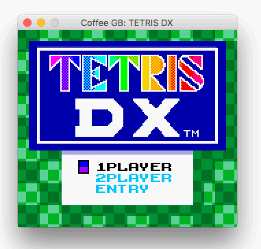
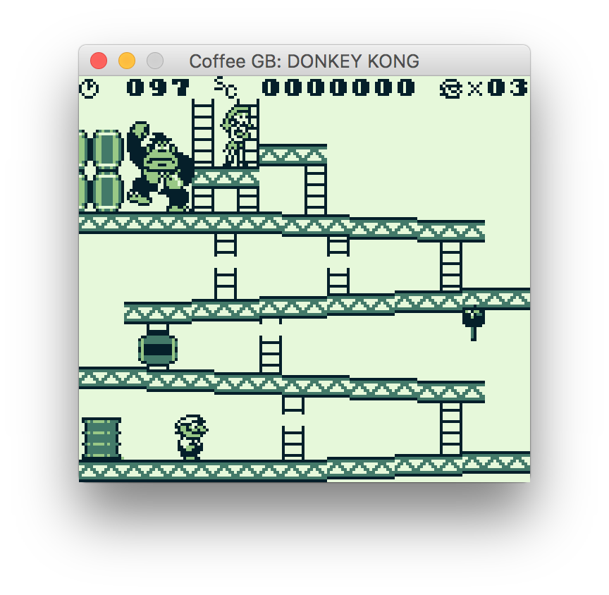
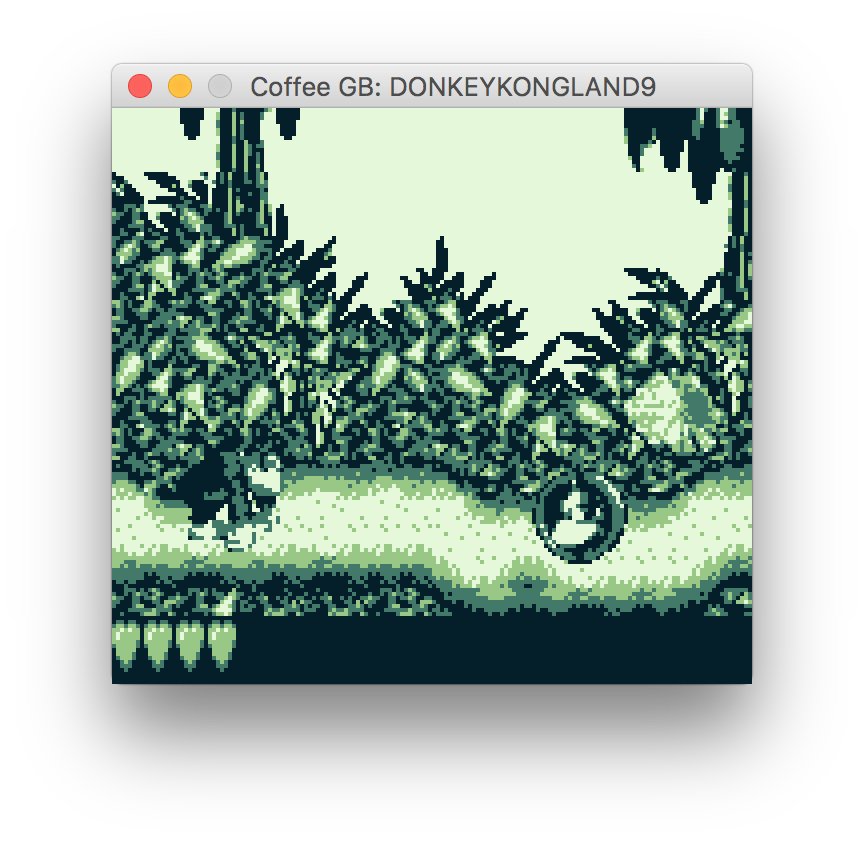
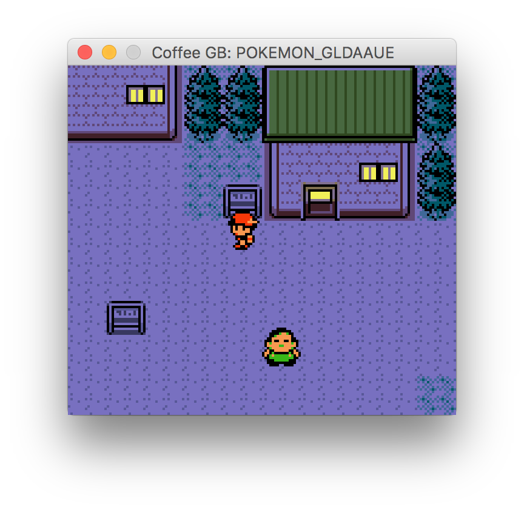
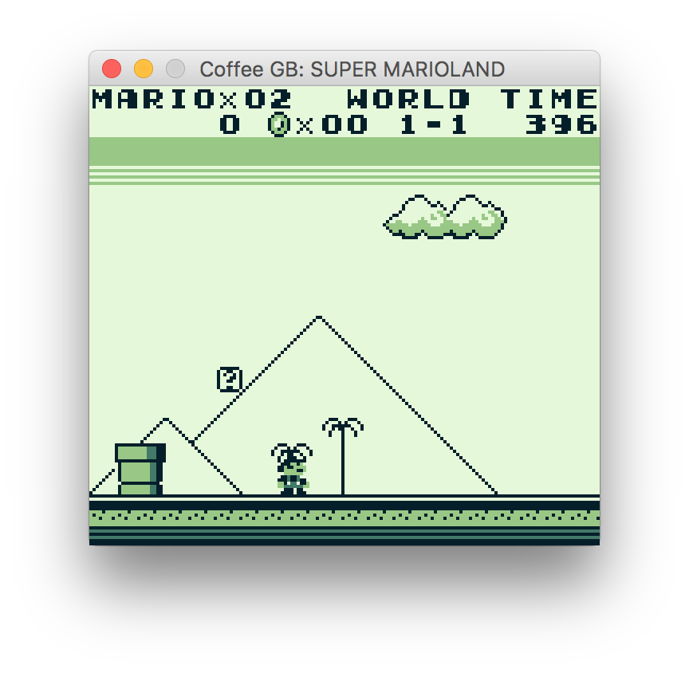
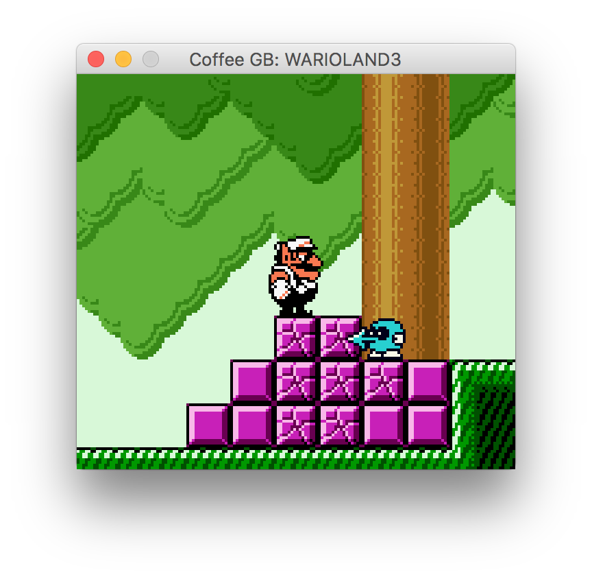
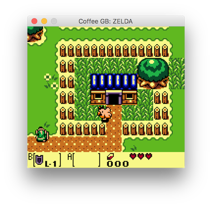
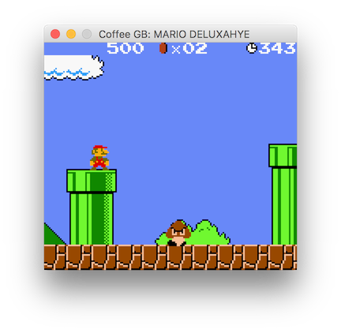
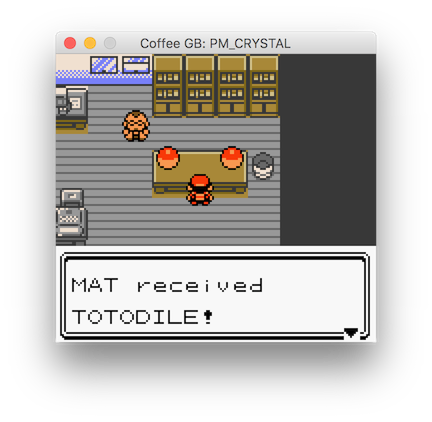
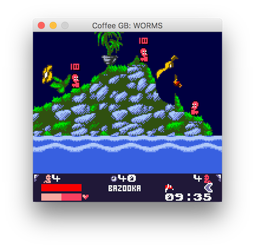

# Coffee GB

[](https://travis-ci.org/trekawek/coffee-gb)

Coffee GB is a Gameboy Color emulator written in Java 8. It's meant to be a development exercise. More info can be found in the blog post [Why did I spend 1.5 months creating a Gameboy emulator?](http://blog.rekawek.eu/2017/02/09/coffee-gb/)



## Building

The emulator can be build with [Maven](https://maven.apache.org/):

    mvn clean package

The jar file will be available in the `./target` directory.

## Usage

    Usage:
    java -jar coffee-gb.jar [OPTIONS] ROM_FILE

    Available options:
      -d  --force-dmg                Emulate classic GB (DMG) for universal ROMs
      -c  --force-cgb                Emulate color GB (CGB) for all ROMs
      -b  --use-bootstrap            Start with the GB bootstrap
      -db --disable-battery-saves    Disable battery saves
          --debug                    Enable debug console
          --headless                 Start in the headless mode

Play with <kbd>&larr;</kbd>, <kbd>&uarr;</kbd>, <kbd>&darr;</kbd>, <kbd>&rarr;</kbd>, <kbd>Z</kbd>, <kbd>X</kbd>, <kbd>Enter</kbd>, <kbd>Backspace</kbd>.

## Features

* Cycle-exact Gameboy CPU emulation. Each opcode is split into a few micro-operations (load value from memory, store it to register, etc.) and each micro-operation is run in a separate CPU cycle.
* Quite compatible (all the Blargg's tests are passed, although some game still doesn't work)
* GPU
* Joypad
* Timer
* Sound
* MBC1-5 support
* Battery saves
* Support for zipped ROMs
* ROM-based compatibility tests run from Maven

## Running Blargg's tests

The [Blargg's test ROMs](http://gbdev.gg8.se/wiki/articles/Test_ROMs) are used for testing the compatibility. Tests can be launched from Maven using appropriate profile:

    mvn clean test -Ptest-blargg
    mvn clean test -Ptest-blargg-individual # for running "single" tests providing more diagnostic info

They are also part of the [Travis-based CI](https://travis-ci.org/trekawek/coffee-gb).

The tests output (normally displayed on the Gameboy screen) is redirected to the stdout:

```
cpu_instrs

01:ok  02:ok  03:ok  04:ok  05:ok  06:ok  07:ok  08:ok  09:ok  10:ok  11:ok

Passed all tests
```

Coffee GB passes all the tests:

* cgb_sound
* cpu_instrs
* dmg_sound-2
* halt_bug
* instr_timing
* interrupt_time
* mem_timing-2
* oam_bug-2

## Mooneye tests

The [Mooneye GB](https://github.com/Gekkio/mooneye-gb) emulator comes with a great set of test ROMs. They can be used to test the Coffee GB as well. Use -Ptest-mooneye profile:

    mvn clean test -Ptest-mooneye

## Screenshots












## Key bindings

The default key bindings can be changed with the `~/.coffeegb.properties` file. The file has following format:

```
btn_up=VK_UP
btn_down=VK_DOWN
btn_left=VK_LEFT
btn_right=VK_RIGHT
btn_a=VK_Z
btn_b=VK_X
btn_start=VK_ENTER
btn_select=VK_BACK_SPACE
```

The key list can be found in the [KeyEvent JavaDoc](https://docs.oracle.com/javase/10/docs/api/java/awt/event/KeyEvent.html#field.summary).

## Resources

* [GameBoy CPU manual](http://marc.rawer.de/Gameboy/Docs/GBCPUman.pdf)
* [The Ultimate GameBoy talk](https://www.youtube.com/watch?v=HyzD8pNlpwI)
* [Gameboy opcodes](http://pastraiser.com/cpu/gameboy/gameboy_opcodes.html)
* [Nitty Gritty Gameboy cycle timing](http://blog.kevtris.org/blogfiles/Nitty%20Gritty%20Gameboy%20VRAM%20Timing.txt)
* [Video Timing](https://github.com/jdeblese/gbcpu/wiki/Video-Timing)
* [BGB emulator](http://bgb.bircd.org/) --- good for testing / debugging, works fine with Wine
* [The Cycle-Accurate Game Boy Docs](https://github.com/AntonioND/giibiiadvance/tree/master/docs)
* [Test ROMs](http://slack.net/~ant/old/gb-tests/) - included in the [src/test/resources/roms](src/test/resources/roms)
* [Pandocs](http://bgb.bircd.org/pandocs.htm)
* [Mooneye GB](https://github.com/Gekkio/mooneye-gb) - an accurate emulator written in Rust, contains great ROM-based acceptance tests
