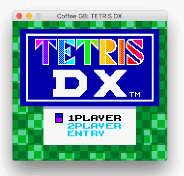

# Coffee GB

<p align="center">
  <strong>A highly compatible Game Boy and Game Boy Color emulator for the desktop.</strong>
</p>

<p align="center">
  <a href="https://github.com/trekawek/coffee-gb/actions/workflows/maven.yml"></a>
  <a href="https://github.com/trekawek/coffee-gb/releases/latest"></a>
  <a href="LICENSE"></a>
</p>

<p align="center">
  
</p>

Coffee GB emulates the original Game Boy (GB/DMG) and Game Boy Color (GBC/CGB).
It is built for high compatibility across the historic game library, unusual
cartridges and accessories, and modern homebrew, demos, and diagnostic ROMs.
The reusable emulation core is written in Java; the desktop application and its
orchestration layer use Kotlin and Java.

## Download and play

Coffee GB is distributed as a single executable JAR. It requires a desktop
**Java 16 or newer** runtime; [Java 21 LTS](https://adoptium.net/temurin/releases/?version=21)
is recommended and is the version used by CI and release builds.

1. Download the JAR from the [latest Coffee GB release](https://github.com/trekawek/coffee-gb/releases/latest).
2. Open it through your desktop's Java launcher, or start it from a terminal:

   ```bash
   java -jar coffee-gb-VERSION.jar
   ```

3. Choose **File > Load ROM**, or pass a ROM on the command line:

   ```bash
   java -jar coffee-gb-VERSION.jar path/to/game.gb
   ```

ROMs are not included. Coffee GB accepts `.gb`, `.gbc`, and `.rom` files, as
well as ZIP archives containing a ROM. On macOS, game-controller support also
requires SDL2 (`brew install sdl2`); keyboard input works without it.

For netplay, one player chooses **Link > Start server** and the other chooses
**Link > Connect to server**.

### Default controls

| Action | Key |
| --- | --- |
| D-pad | Arrow keys |
| A / B | <kbd>Z</kbd> / <kbd>X</kbd> |
| Start / Select | <kbd>Enter</kbd> / <kbd>Shift</kbd> |
| Pause | <kbd>Space</kbd> |
| Save / load state | <kbd>F5</kbd> / <kbd>F7</kbd> |
| Rewind | Hold <kbd>Backspace</kbd> |

In single-player mode, there are ten save-state slots. Battery saves (`.sav`)
and save states (`.sn0`&ndash;`.sn9`) are stored next to the ROM. Pause, save
states, and rewind are disabled during netplay.

<details>
<summary>Custom keyboard mapping</summary>

Edit `~/.coffeegb.properties` and use
[`KeyEvent`](https://docs.oracle.com/en/java/javase/21/docs/api/java.desktop/java/awt/event/KeyEvent.html)
constant names:

```properties
btn_up=VK_UP
btn_down=VK_DOWN
btn_left=VK_LEFT
btn_right=VK_RIGHT
btn_a=VK_Z
btn_b=VK_X
btn_start=VK_ENTER
btn_select=VK_SHIFT
```

</details>

## Features

- **Systems:** full DMG and CGB emulation, plus Super Game
  Boy borders and palettes.
- **Hardware-focused accuracy:** a cycle-stepped CPU and high-accuracy PPU, APU,
  timer, DMA, serial, and infrared behavior.
- **Everyday play:** battery-backed saves, ten save-state slots, pause/reset,
  hold-to-rewind, recent ROMs, and ZIP archive loading.
- **Rollback netplay:** TCP multiplayer for link-cable games, with local rollback
  hiding normal network latency and synchronized infrared communication.
- **Broad cartridge support:** MBC1/1M, MBC2, MBC3 with RTC and MBC30, MBC5,
  MBC6 with flash, MBC7 with EEPROM/accelerometer, MMM01, HuC1, HuC3, TAMA5,
  Pocket Camera, and numerous unlicensed and multicart mappers.
- **Accessories:** webcam-backed Game Boy Camera, Game Boy Printer with PNG
  export, Barcode Boy, Full Changer infrared, Datel Action Replay pass-through,
  cartridge rumble, and tilt input.
- **Desktop controls and display:** keyboard and game-controller input, scaling,
  rotation, grayscale, CGB color correction, LCD ghosting, and an SGB-border toggle.
- **Cheats:** Game Genie and GameShark codes, plus a bundled searchable
  [libretro cheat database](https://github.com/libretro/libretro-database/tree/master/cht/Nintendo%20-%20Game%20Boy).

## Compatibility

Compatibility is treated as a continuously tested feature, not as a static game
list. The test profiles exercise **5,721 cases from 13 suite families**. Every
automated verdict is guarded: exact hardware results are required where Coffee
GB matches them, while unresolved Gambatte outputs are pinned against regressions.

> **Pixel status:** both Acid2 references and all 24 Mealybug Tearoom reference
> images are pixel-perfect.

| Test suite | Cases exercised | Current result |
| --- | ---: | --- |
| [Blargg](https://github.com/retrio/gb-test-roms) | 54 | 54 / 54 pass\* |
| [Mooneye Test Suite](https://github.com/Gekkio/mooneye-test-suite) | 130 | 130 / 130 selected cases pass |
| [RTC3Test](https://github.com/aaaaaa123456789/rtc3test) | 3 | 3 / 3 menus pass |
| [SameSuite](https://github.com/LIJI32/SameSuite) | 71 | 71 / 71 later-revision cases pass |
| [Gambatte HWTests](https://github.com/pokemon-speedrunning/gambatte-core/tree/master/test) | 4,674 | 4,519 match hardware; 155 current outputs are pinned exactly |
| [BullyGB](https://github.com/Ashiepaws/BullyGB) | 2 | 2 / 2 DMG and CGB cases pass |
| [MBC30Test](https://github.com/ZoomTen/mbc30test) | 1 | 1 / 1 ROM banking and SRAM case passes |
| [Daid / GB Emulator Shootout](https://github.com/gbdev/GBEmulatorShootout/tree/main/testroms/daid) | 9 | 8 / 8 images have no out-of-tolerance pixels; ROM+RAM passes |
| [DMG-ACID2](https://github.com/mattcurrie/dmg-acid2) and [CGB-ACID2](https://github.com/mattcurrie/cgb-acid2) | 2 | 2 / 2 are pixel-perfect |
| [Mealybug Tearoom](https://github.com/mattcurrie/mealybug-tearoom-tests) | 24 | 24 / 24 are pixel-perfect |
| [GBMicrotest](https://github.com/aappleby/GBMicrotest) | 513 | 482 / 482 machine-readable verdicts pass; 31 diagnostic ROMs have no verdict |
| [gbc-hw-tests](https://github.com/alyosha-tas/gbc-hw-tests) | 221 | 221 / 221 hardware-capture verdicts match |
| [Misc.-GB-Tests](https://github.com/alyosha-tas/Misc.-GB-Tests) | 17 | 17 / 17 pass verdicts match |
| **Total** | **5,721** | **Every result is checked against hardware or an exact current baseline** |

\* Blargg's aggregate and individual checks overlap by design.

<details>
<summary>How strict compatibility results are interpreted</summary>

Every ROM with a machine-readable result must produce its documented pass value,
match its selected raw hardware capture, or match an exact documented current
output. Gambatte's 155 unresolved cases are likewise pinned to their complete
hexadecimal output, so any change fails CI; a hardware-correct improvement removes
the corresponding baseline entry.

</details>

<details>
<summary>Running the exhaustive Gambatte profile</summary>

The profile evaluates all 4,674 canonical hexadecimal DMG/CGB verdicts from
3,077 ROMs with two parameter workers by default in a test JVM capped at 1 GiB.
It passes only when every case matches hardware or the exact current-output
baseline:

```bash
mvn clean test -f core/pom.xml -Ptest-gambatte-hw
```

For bounded local runs, set both `gambatte.batchCount` and the zero-based
`gambatte.batchIndex`. Every index must run; batching partitions the pinned
manifest and does not suppress failures:

```bash
mvn test -f core/pom.xml -Ptest-gambatte-hw \
  -Dgambatte.batchCount=64 -Dgambatte.batchIndex=0
```

</details>

## AI-assisted compatibility work

Since 2026, Coffee GB has used AI coding agents as compatibility research tools.
A purpose-built [`controller.Agent`](controller/src/main/java/eu/rekawek/coffeegb/controller/Agent.kt)
API lets an agent run a ROM headlessly under scripted control, inject input,
capture frames and audio, inspect registers and memory, and disassemble
execution without driving the desktop UI.

The working loop is deliberately evidence-based:

1. Reproduce a reported problem with scripted input and capture the first point
   where emulation diverges.
2. Diagnose it against hardware-backed test ROMs, hardware captures, schematics,
   and targeted comparisons with reference emulators.
3. Make a focused change, add a regression test where practical, and run the
   focused checks; CI runs the full compatibility matrix before merge.

This makes AI useful for exploring difficult timing and cartridge edge cases,
while hardware evidence, automated tests, and maintainer review remain the
standard for correctness.

## Project history

Coffee GB began as a six-week deep dive into how a small computer works. The
[2017 origin story](https://blog.rekawek.eu/2017/02/09/coffee-gb/) covers the CPU,
pixel pipeline, audio, early compatibility testing, and first GBC implementation.
The later [rollback-netplay article](https://blog.rekawek.eu/2025/07/26/rollback-netplay-gb/)
explains how per-frame snapshots made high-latency link play practical.

| Date | Milestone |
| --- | --- |
| 31 Dec 2016 | [The project starts](https://github.com/trekawek/coffee-gb/commit/f83a638c6c296adbf8020f24cea80be23f69fb10). |
| 14 Jan 2017 | [The first playable version runs Tetris](https://github.com/trekawek/coffee-gb/commit/624885e1b6a390fd4ddc10ffb16d7375e2d43647), two weeks after the initial commit. |
| 5&ndash;7 Feb 2017 | [Game Boy Color support](https://github.com/trekawek/coffee-gb/commit/4ca6808b79bedc6a68311ed5402d9b54456e1ffd) lands with double-speed mode, banked RAM/VRAM, color graphics, and the GBC boot path. |
| 22 Dec 2017 | [Coffee GB 1.0.0](https://github.com/trekawek/coffee-gb/releases/tag/coffee-gb-1.0.0) is released. |
| 29 Feb 2024 | [Save-state support](https://github.com/trekawek/coffee-gb/commit/1ec86cb4aa8d69e3289f0542ea509013b228b67d) is added. |
| Jul 2025 | Fast mementos enable [rollback netplay](https://blog.rekawek.eu/2025/07/26/rollback-netplay-gb/), released in [1.5.0](https://github.com/trekawek/coffee-gb/releases/tag/coffee-gb-1.5.0). |
| Aug 2025 | [Super Game Boy borders and palettes](https://github.com/trekawek/coffee-gb/releases/tag/coffee-gb-1.5.2) arrive alongside command support and predefined game palettes. |
| Feb 2026 | [The headless agent interface](https://github.com/trekawek/coffee-gb/commit/377742d41f80105f8e042b9eccd1b257f7dadc2b) begins the AI-assisted compatibility workflow. |

## Architecture

Coffee GB is a Maven reactor with three modules. The dependency flow is
`swing` &rarr; `controller` &rarr; `core`; the desktop module also uses the core
directly.

| Module | Role | Depends on |
| --- | --- | --- |
| [`core`](core) | Reusable Java emulation engine: CPU, graphics, audio, memory, cartridges, serial/IR, SGB, and peripherals. | &mdash; |
| [`controller`](controller) | Kotlin orchestration: sessions, timing, save states, rewind, rollback history, and networking. | `core` |
| [`swing`](swing) | Kotlin/Java desktop UI, video/audio/input adapters, webcam and printer integration, and executable-JAR packaging. | `controller`, `core` |

The root [`pom.xml`](pom.xml) defines the reactor and shared build configuration.

## Build from source

Use a **JDK 16 or newer** and [Maven](https://maven.apache.org/) to build. JDK 21
is recommended and is used by CI.

```bash
git clone https://github.com/trekawek/coffee-gb.git
cd coffee-gb
mvn clean package
```

The executable fat JAR is created in `swing/target/`. On a development snapshot,
run it with:

```bash
java -jar swing/target/coffee-gb-*-SNAPSHOT.jar
```

## Kudos

Special thanks to [@ScottNash042](https://github.com/ScottNash042), whose
thorough compatibility testing, hard-to-find edge-case reports, and thoughtful
feature proposals have provided enormous value to Coffee GB.

Coffee GB also owes a great deal to the Game Boy hardware research community
and to the authors of every test suite linked above.

## License

Coffee GB is available under the [MIT License](LICENSE).
