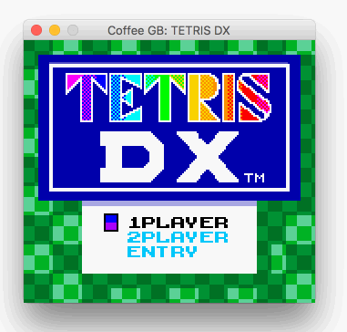

# Coffee GB

  <strong>A highly compatible Game Boy and Game Boy Color emulator for the desktop.</strong>

  

Coffee GB emulates the original Game Boy (GB/DMG) and Game Boy Color (GBC/CGB).
It is built for high compatibility across the historic game library, unusual
cartridges and accessories, and modern homebrew, demos, and diagnostic ROMs.
The reusable emulation core is written in Java; the desktop application and its
orchestration layer use Kotlin and Java.

**[Download the latest Coffee GB release](https://github.com/trekawek/coffee-gb/releases/latest)**

## Features

- **Game Boy and Game Boy Color emulation**, with Super Game Boy borders and
  palettes.
- **High compatibility** across commercial games, unusual cartridges, homebrew,
  demos, and diagnostic ROMs.
- **Save states and rewind**, including ten save slots, named states, previews,
  autosave and resume, screenshots, and battery-backed saves.
- **Easy game loading** with drag and drop and support for `.gb`, `.gbc`, and
  `.rom` files, either directly or from ZIP and 7z archives.
- **Rollback netplay** for link-cable games, with synchronized infrared
  communication.
- **Customizable display and sound**, including fullscreen, scaling, rotation,
  grayscale, color correction, LCD ghosting, audio-device selection, and volume
  and latency controls.
- **Keyboard and game-controller support**, including independent controls for
  up to four players in compatible Super Game Boy games.
- **Broad cartridge and accessory support**, including real-time clocks, rumble,
  tilt controls, Game Boy Camera, Game Boy Printer, Barcode Boy, Full Changer,
  and Datel Action Replay pass-through.
- **Game Genie and GameShark cheats**, with a bundled searchable
  [libretro cheat database](https://github.com/libretro/libretro-database/tree/master/cht/Nintendo%20-%20Game%20Boy).

ROM files are not included.

## Controls

Default keyboard controls:

| Action | Key |
| --- | --- |
| D-pad | Arrow keys |
| A / B | <kbd>Z</kbd> / <kbd>X</kbd> |
| Start / Select | <kbd>Enter</kbd> / <kbd>Shift</kbd> |
| Pause | <kbd>Space</kbd> |
| Save / load state | <kbd>F5</kbd> / <kbd>F7</kbd> |
| Take screenshot | <kbd>F12</kbd> |
| Rewind | Hold <kbd>Backspace</kbd> |
| Toggle fullscreen | <kbd>F11</kbd>; <kbd>Esc</kbd> exits fullscreen |

Keyboard and game-controller bindings can be changed in **File > Preferences…**.
The same window contains display, sound, and save settings.
On macOS, game-controller input requires a compatible system SDL2 installation;
keyboard input works without it.

Use **Game > Manage States…** to choose among the ten save slots, name states,
preview them, and export them. Autosave and resume settings are under
**File > Preferences… > Saves & Rewind**. See
[save states, autosave, screenshots, and rewind](docs/state-management.md) for
more details. Pause, save states, and rewind are unavailable during netplay.

## Compatibility

Compatibility is a defining feature of Coffee GB. Its test profiles exercise
**5,696 automated verdicts from 16 suite families**, covering all popular Game
Boy and Game Boy Color test suites, and every verdict passes. Coffee GB also
earns the **maximum score** in
[GBEmulatorShootout](https://tomek.rekawek.eu/GBEmulatorShootout/).

Every exact-reference image suite is pixel-perfect: both Acid2 tests,
CGB-ACID-HELL, Strikethrough, all four CasualPokePlayer tests, and all 24
Mealybug Tearoom tests.

Detailed compatibility results

| Test suite | Cases exercised | Current result |
| --- | ---: | --- |
| [Blargg](https://github.com/retrio/gb-test-roms) | 54 | 54 / 54 pass\* |
| [Mooneye Test Suite](https://github.com/Gekkio/mooneye-test-suite) | 130 | 130 / 130 selected cases pass |
| [RTC3Test](https://github.com/aaaaaa123456789/rtc3test) | 3 | 3 / 3 menus pass |
| [SameSuite](https://github.com/LIJI32/SameSuite) | 71 | 71 / 71 later-revision cases pass |
| [Gambatte HWTests](https://github.com/pokemon-speedrunning/gambatte-core/tree/master/test) | 4,674 | 4,674 / 4,674 canonical DMG/CGB verdicts match hardware |
| [BullyGB](https://github.com/Ashiepaws/BullyGB) | 2 | 2 / 2 DMG and CGB cases pass |
| [MBC30Test](https://github.com/ZoomTen/mbc30test) | 1 | 1 / 1 ROM banking and SRAM case passes |
| [GBEmulatorShootout](https://github.com/gbdev/GBEmulatorShootout/) — specific tests | 9 | Maximum score; 8 / 8 images and the ROM+RAM test pass |
| [DMG-ACID2](https://github.com/mattcurrie/dmg-acid2) and [CGB-ACID2](https://github.com/mattcurrie/cgb-acid2) | 2 | 2 / 2 are pixel-perfect |
| [CGB-ACID-HELL](https://github.com/mattcurrie/cgb-acid-hell) | 1 | 1 / 1 is pixel-perfect |
| [Strikethrough](https://github.com/Ashiepaws/strikethrough.gb) | 1 | 1 / 1 is pixel-perfect |
| [CasualPokePlayer test ROMs](https://github.com/CasualPokePlayer/test-roms) | 4 | 4 / 4 are pixel-perfect |
| [Mealybug Tearoom](https://github.com/mattcurrie/mealybug-tearoom-tests) | 24 | 24 / 24 are pixel-perfect |
| [GBMicrotest](https://github.com/aappleby/GBMicrotest) | 482 | 482 / 482 machine-readable verdicts pass; 31 additional diagnostics have no automated verdict |
| [gbc-hw-tests](https://github.com/alyosha-tas/gbc-hw-tests) | 221 | 221 / 221 selected hardware-reference verdicts match exactly |
| [Misc.-GB-Tests](https://github.com/alyosha-tas/Misc.-GB-Tests) | 17 | 17 / 17 pass verdicts match |
| **Total** | **5,696** | **5,696 / 5,696 automated verdicts pass** |

\* Blargg's aggregate and individual checks overlap by design.

Every automated case must produce its documented pass value, match its selected
external hardware reference, or satisfy its upstream image oracle. The source
revisions, archive membership, hardware models, and ROM revisions used by these
profiles are fixed for reproducibility. GBMicrotest's 31 non-verdict diagnostics
are tracked separately and are not included in the 5,696 automated verdicts.

## Netplay

For link-cable multiplayer, open **Game > Netplay…**. One player selects
**Host > Start hosting**; the other selects **Join**, enters the host's address,
and selects **Join game**. Netplay uses a direct, unencrypted TCP connection, so
play only with people and networks you trust.

## Project history

Coffee GB began as a six-week deep dive into how a small computer works. The
[2017 origin story](https://blog.rekawek.eu/2017/02/09/coffee-gb/) covers the CPU,
pixel pipeline, audio, early compatibility testing, and first GBC implementation.
The later [rollback-netplay article](https://blog.rekawek.eu/2025/07/26/rollback-netplay-gb/)
explains how per-frame snapshots made high-latency link play practical.

| Date | Milestone |
| --- | --- |
| 31 Dec 2016 | [The project starts](https://github.com/trekawek/coffee-gb/commit/f83a638c6c296adbf8020f24cea80be23f69fb10). |
| 14 Jan 2017 | [The first playable version runs Tetris](https://github.com/trekawek/coffee-gb/commit/624885e1b6a390fd4ddc10ffb16d7375e2d43647), two weeks after the initial commit. |
| 5–7 Feb 2017 | [Game Boy Color support](https://github.com/trekawek/coffee-gb/commit/4ca6808b79bedc6a68311ed5402d9b54456e1ffd) lands with double-speed mode, banked RAM and VRAM, color graphics, and the GBC boot path. |
| 22 Dec 2017 | [Coffee GB 1.0.0](https://github.com/trekawek/coffee-gb/releases/tag/coffee-gb-1.0.0) is released. |
| 29 Feb 2024 | [Save-state support](https://github.com/trekawek/coffee-gb/commit/1ec86cb4aa8d69e3289f0542ea509013b228b67d) is added. |
| Jul 2025 | Fast mementos enable [rollback netplay](https://blog.rekawek.eu/2025/07/26/rollback-netplay-gb/), released in [1.5.0](https://github.com/trekawek/coffee-gb/releases/tag/coffee-gb-1.5.0). |
| Aug 2025 | [Super Game Boy borders and palettes](https://github.com/trekawek/coffee-gb/releases/tag/coffee-gb-1.5.2) arrive alongside Super Game Boy command support and predefined game palettes. |

## Kudos

Special thanks to [@ScottNash042](https://github.com/ScottNash042), whose
thorough compatibility testing, hard-to-find edge-case reports, and thoughtful
feature proposals have provided enormous value to Coffee GB.

Coffee GB also owes a great deal to the Game Boy hardware research community
and to the authors of every test suite linked above.

## License

Coffee GB is available under the [MIT License](LICENSE).
