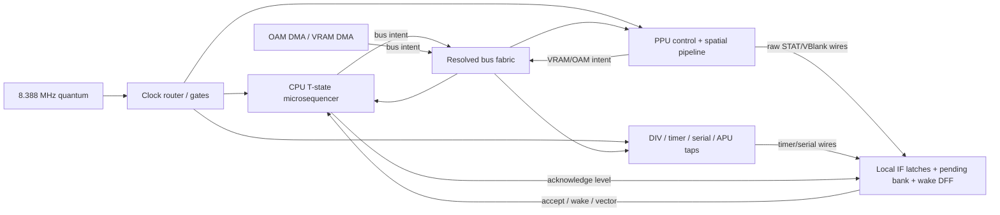

# A signal-driven core for Coffee GB

Status: architectural hypothesis and migration design; not a merge-ready whole-core replacement

Baseline: `8560a6c2` (2026-08-13)

Scope: `core/`, with DMG as the first implementation target and CGB retained during migration

Evidence log: [signal-driven-core-experiments.md](signal-driven-core-experiments.md)

External-oracle manifest: [signal-oracle-repro.md](signal-oracle-repro.md)

## Executive conclusion

The evidence supports a promising route to a substantially simpler model, but the overnight spike
does not yet establish that replacement for the whole core. Two narrow production cuts were
completed: the local Serial DIV-reset path and CH1 sweep-trigger scheduling. The other subsystem
results are constructive, fitted, differential, or falsifying experiments whose exact evidence
strength is recorded in the companion log.

The candidate is not a shorter formula for PPU modes, interrupt delays, or APU counters.

The simplifying change is to stop treating CPU, PPU, timer, APU, serial, and DMA as sequential
objects that each own a notion of "now" and mutate one another once per Java callback. The Game
Boy is better represented as:

1. one explicit clock tree;
2. persistent bus transactions and resolved shared buses;
3. wires, latches, edge detectors, and short synchronizer pipelines;
4. simultaneous state commit; and
5. behavioral data planes attached to that signal fabric.

The current model makes Java call order stand in for signal propagation. When two hardware effects
occur inside one coarse callback, the code has to recover their ordering by predicting a future CPU
access, preserving an old peripheral view, replaying a bus value, delaying an interrupt for one
consumer but not another, or running and repairing a second PPU timeline. Most of the apparent
corner cases are instances of that single abstraction leak.

The proposed model is called the **Clocked Signal Fabric** in this document. It is a hybrid, not a
whole-chip gate simulator:

- Control and arbitration are expressed as small circuit-like islands.
- CPU arithmetic, PPU tile/pixel data, APU oscillators, and mixing remain behavioral.
- The DMG schematic/netlist is used as an offline waveform oracle and as a source of topology,
  not interpreted cell by cell in production.
- DMG and CGB use separate behavioral wiring/topologies where the silicon differs, rather than
  sharing one branch-heavy state machine.

This will not make real hardware complexity disappear. It should make that complexity local and
compositional. The target is not "zero special behavior"; it is "no subsystem predicts another
subsystem's future."

## Why the present abstraction is the likely root cause

### The top-level loop is already an implicit circuit solver

`Gameboy.tickSubsystems()` (`Gameboy.java:703-895`) currently decides causality by procedure:

- It asks the CPU to predict STAT/IF read and interrupt-acceptance behavior before running it.
- It advances the timer and samples the APU frame sequencer before the CPU.
- It conditionally commits the APU frame-sequencer edge before or after the CPU access.
- It contains the CPU/HDMA ownership protocol and speed-switch tail arithmetic.
- It transfers a transient VRAM-DMA bus sample into OAM DMA.
- It runs the PPU and STAT after the CPU, followed by a CPU post-peripheral hook.

That order is part of the emulated timing model. Consequently, changing which object is called
first changes which state another object sees. A real chip does not call its timer before its CPU;
signals coexist, settle, and are sampled at particular edges.

### The CPU predicts bus cycles that do not exist yet

The CPU advances instructions atomically at machine-cycle boundaries (`Cpu.java:165-484`). To
answer races at finer phases, it later acquired code that:

- predicts an upcoming FF0F read, including decoding beyond a NOP (`Cpu.java:795-833`);
- speculatively decodes instructions and operands (`Cpu.java:874-956`);
- predicts DI and IE writes for interrupt acceptance (`Cpu.java:842-890`); and
- prefetches, copies, claims, releases, and replays opcodes for HDMA (`Cpu.java:989-1177`).

Hardware needs none of that semantic foresight. During the relevant interval it already exposes an
address, RD/WR strobes, data, and a CPU T-state. The prediction exists because an M-cycle is
currently an instantaneous method call instead of a persistent transaction.

### Interrupt provenance substitutes for physical sampling paths

`InterruptManager` stores multiple interpretations of the same IF bits: CPU-blocked,
HALT-blocked, phased PPU, mode-2, first-line, instruction-blocked, read-preview, and acknowledge
state (`InterruptManager.java:42-122`). It exposes several source-publication variants at
`InterruptManager.java:126-229`.

The derived model already gives the simpler explanation: a source sets an IF latch; readable IF,
the running CPU's acceptance path, and HALT's wake path sample different nodes or synchronizer
stages. One source pulse plus multiple physical observation points is simpler than attaching
provenance to the event and carrying it through software.

Timer and serial show the same issue from the other side. During interrupt acknowledgement they
look ahead to decide whether a future request should be suppressed or pulled into the acknowledge
window (`Timer.java:101-130`, `SerialPort.java:81-105`). With an acknowledge level and an IF
set/reset latch, the two signals simply overlap in chronological order.

### The PPU represents pipeline distance as duplicate time and time travel

`Gpu` owns two complete `PixelTransfer` instances (`Gpu.java:73-81`, `Gpu.java:239-243`): an
unshifted timing skeleton and a renderer four dots behind it. Both are advanced and serialized.
Selected register writes are then copied into the delayed domain through queues.

Inside the renderer:

- fetch state names and actual VRAM read points are displaced (`Fetcher.java:315-359`);
- object/window high bytes are reread and old FIFO/output values are patched
  (`PixelTransfer.java:763-817`, `DmgPixelFifo.java:264-297`);
- window activation can rewind an already popped pixel and horizontal position
  (`PixelTransfer.java:820-855`, `DmgPixelFifo.java:221-235`); and
- an object-enable abort catches up by executing three render/fetch iterations immediately
  (`PixelTransfer.java:986-1004`).

Those operations are strong evidence that physical distance between address, data, shifter, raw
pixel, and LCD stages is represented as two clocks plus repair operations. A forward-only spatial
pipeline should make rollback and post-hoc patching impossible.

`Gpu.getVisibleStatMode()` is another symptom. It is followed by hundreds of lines of CPU-specific
mode, LY, lock, HALT, and edge overrides (`Gpu.java:1094-1973`). The hardware does not have one
authoritative `Mode` value from which every observation follows. It has separate internal state,
readable mode latches, bus gates, STAT source signals, LY paths, and LCD output strobes.

### APU, serial, DMA, and speed switching repeat the pattern

- `Sound` samples and commits the DIV-derived frame-sequencer edge on different sides of the CPU
  callback (`Sound.java:216-267`).
- Serial reconstructs its phase arithmetically after DIV reset (`SerialPort.java:107-140`).
- HDMA stores copies of GPU and CPU timing and exposes a large handshake/introspection surface
  (`Hdma.java:394-825`).
- OAM DMA receives one-tick collision samples copied from HDMA (`Dma.java:64-80`,
  `Dma.java:196-203`).
- Speed switching is distributed across `SpeedMode`, CPU, `Gameboy`, GPU, timer, sound, OAM DMA,
  and HDMA. `Gameboy` combines several calibrated tail/alignment constants with current PPU and
  DMA state (`Gameboy.java:95-124`, `Gameboy.java:741-769`).

These look unrelated at the feature level. At the mechanism level they are mostly:

1. a clock source or mux changing while high;
2. a pulse crossing a clock boundary through one or more latches;
3. two edges inside one coarse emulator tick; or
4. two masters contending for a physical bus.

### The growth history supports the diagnosis

The following seven timing-heavy files contain 11,349 lines at the baseline:

| File | Lines |
| --- | ---: |
| `Gameboy.java` | 2,180 |
| `Cpu.java` | 1,324 |
| `InterruptManager.java` | 645 |
| `Gpu.java` | 2,483 |
| `StatRegister.java` | 2,208 |
| `PixelTransfer.java` | 1,473 |
| `Hdma.java` | 1,036 |

At `e5a117d3`, the July 2 schematic-derived DMG accuracy change, the same paths totalled 1,924
lines. There have since been 232 commits touching the selected CPU/GPU/timer/APU/DMA/serial timing
paths. Some growth is debugging, save-state, performance, CGB, and other legitimate functionality,
so line count is not proof. The evolution is nevertheless consistent with knowledge being added
as compensating temporal state rather than as a small set of reusable hardware mechanisms.

## The Clocked Signal Fabric

### One global quantum, several real clock domains

Use half a PPU dot, 1 / 8,388,608 second, as the internal time quantum.

| Hardware mode | PPU edge | CPU T-state | CPU M-cycle |
| --- | ---: | ---: | ---: |
| DMG/MGB/SGB | every 2 quanta | 2 quanta | 8 quanta |
| CGB normal speed | every 2 quanta | 2 quanta | 8 quanta |
| CGB double speed | every 2 quanta | 1 quantum | 4 quanta |

The public `Gameboy.tick()` contract can remain one PPU dot by executing two internal quanta. This
also preserves the current host audio cadence initially.

A half-dot is necessary because the current one-dot callback collapses two CGB double-speed CPU
clocks into a loop. It is not sufficient by itself. Each quantum also has non-time-advancing delta
phases:

1. **CLOCK** — derive edge and gate signals from authoritative clock-router state.
2. **DRIVE** — old state drives addresses, data, strobes, request wires, and combinational outputs.
3. **RESOLVE** — decode addresses, arbitrate owners, resolve tri-state/held buses, and settle
   combinational signal groups.
4. **CAPTURE** — every latch computes its next state from the resolved signals and active edges.
5. **COMMIT** — all latch state becomes visible simultaneously.
6. **PUBLISH** — queue debugger, audio, frame, rumble, and host events after machine state commits.

Java invocation order is not observable inside those phases. No emulated component mutates another
component's committed state. Where a transparent-latch or combinational feedback island requires
settling, that bounded island runs local delta iterations; time does not advance.

The asynchronous DMG divider ripple is an important exception. Its observable intermediate value
cannot be reproduced by instantly settling a zero-delay Boolean graph. Give that small island
ordered propagation deltas or annotated local gate depth rather than making the whole emulator's
global clock finer.



### Keep the primitive set small and static

The useful reusable semantics are:

- edge detector;
- clock gate and muxed clock;
- D latch/DFF and transparent latch;
- set/reset latch with an explicit same-edge dominance table;
- fixed delay line or synchronizer;
- counter/ripple stage;
- tri-state or held-bus resolver; and
- static-priority bus arbiter.

This should not be a dynamic graph of allocated `Wire` objects called millions of times per second.
Use the primitives to specify topology, then implement or generate compact, allocation-free,
straight-line Java over primitive fields. The conceptual split is `Q` (committed latches), resolved
signals, and `D` (next latch state). Save states contain `Q`, never transient resolved wires.

### Persistent CPU bus cycles

Every CPU M-cycle becomes a `BusCycle` that persists through T1-T4. It exposes:

- owner and micro-operation;
- T-state and address-valid phase;
- address;
- RD and WR levels;
- driven write data;
- sampled read data; and
- the completion action that updates CPU architectural state.

The existing `Op` metadata is a migration seam: it already classifies reads/writes and can compute
addresses and values. Opcode tables can initially compile the same operations into bus microcycles,
retaining existing ALU/register delegates.

Do not correct Coffee GB's known late CPU-read timing during this migration. First reproduce the
current calibrated sampling point in the explicit cycle. Correcting it later should be a distinct
experiment because boot DIV presets and PPU anchors are interlocked with it.

Once the cycle is present:

- STAT observes an actual FF0F read strobe, not a decoded future instruction.
- DI/EI and IE writes exist as current control/bus signals.
- DMA arbitrates with an actual CPU request.
- Open-bus values are the held resolved bus value.
- Debug memory traces occur at bus sample/commit.

### Several buses, not one universal memory callback

`AddressSpace` is a useful logical device decoder, but immediate `getByte`/`setByteFromCpu` calls do
not describe bus timing or ownership. Put an adapter behind it during migration, then model the
physically relevant fabrics separately:

- CPU/main and I/O bus;
- cartridge/WRAM source paths where electrical behavior differs;
- VRAM bus;
- OAM bus; and
- wave-RAM port.

CPU, PPU, OAM DMA, and VRAM DMA submit persistent intents. Arbitration selects enables; devices
drive or release data; the fabric resolves multiple drivers and maintains held/open-bus state.
Collision behavior then belongs to the bus topology rather than to one participant receiving a
copied value from another.

Not every bus must use a generic electrical formula. Proven DMG/CGB collision truth tables can be
local resolver policies. The architectural requirement is that ownership and driven signals are
first-class, not inferred from another subsystem's mode and opcode.

## Subsystem models on the fabric

### CPU, HALT, and interrupt dispatch

Implement HALT according to the external DMG gate-model trace. Direct HALT decode is absent from
the decoder's IDU-increment equation even though fetch, instruction-register load, and PC write
remain active. HALT therefore samples the following opcode while writing the unchanged IDU value
back to PC. A separately delayed HALT decode only sets the reset-dominant sleep latch. If a pending
interrupt wins that latch race, the CPU never sleeps and the sampled opcode is fetched again from
the unchanged address: the halt bug emerges without a `haltBugMode`, PC rewind, or a delayed
next-fetch gate. During ordinary HALT, the sleep latch retains after the delayed set pulse and the
already sampled opcode waits for wake.

Keep interrupt dispatch as a real five-M-cycle microprogram. On DMG, let transparent `IE & IF`
latches sample pending sources during their data-phase aperture. Their held bits then feed both the
priority/vector logic and the one-hot acknowledge decoder. A higher-priority source redirects the
entry only if it reaches that bank before the aperture closes; no future-opcode query or
`applyLateInterruptPriority` repair is needed.

### Interrupt control island

Inputs:

- one raw request pulse/level for VBlank, STAT, timer, serial, and joypad;
- CPU FF0F/FFFF bus strobes and data;
- DI, EI, RETI, HALT, and instruction-boundary signals; and
- interrupt acknowledge level and CPU phase clocks.

State:

- five set/reset IF latches;
- IE;
- IME and EI-delay latch;
- HALT gate;
- separate running-acceptance and HALT-wake synchronizer stages; and
- the phase-transparent pending bank and its held source bits.

Outputs:

- FF0F/FFFF bus data;
- readable pending state;
- running CPU request;
- HALT wake;
- current priority/vector; and
- source acknowledge levels.

"IF is readable now," "the running CPU can accept now," and "HALT can wake now" remain distinct
facts, but they are values at different nodes. Per-source request-publication methods disappear.
Set versus FF0F write, set versus acknowledge, IE write versus acceptance, and EI/DI versus boundary
sampling each get one explicit dominance table.

### Clock router, STOP, and boot phase

Use one clock-router FSM:

```text
RUN_NORMAL -> STOP_ENTRY -> SWITCH_DELAY -> MUX_SETTLE -> RUN_DOUBLE
RUN_DOUBLE -> STOP_ENTRY -> SWITCH_DELAY -> MUX_SETTLE -> RUN_NORMAL
```

It owns CPU/timer/serial/DMA clock enables, speed-mux phase, and settling. The PPU remains on the
fixed dot clock. The long switch delay is real state; PPU-line- and DMA-specific tail arithmetic
should emerge from clock edges and bus grants rather than be selected by the top-level loop.

A hardware profile's reset/SKIP state must become coherent phase state, not independent register
presets. Include at least global half-dot parity, CPU T-state, divider/ripple state, PPU phase,
serial phase, and speed-mux phase. NORMAL boot reaches those states by execution; SKIP boot restores
a profile-specific post-boot checkpoint.

### Timer, DIV, and serial

The timer island contains named stages:

- divider/ripple nodes;
- TAC clock mux and falling-edge detector;
- TIMA counter;
- overflow/reload delay stages;
- TMA reload path; and
- timer request wire.

The existing overflow delay is real hardware state and remains. DMG versus CGB TAC behavior is a
topology difference: a direct mux path on CGB and a delayed path on DMG. A request that coincides
with CPU acknowledge meets that acknowledge at the shared IF latch, so neither timer nor serial
looks into the future.

Serial is a good first vertical slice because it is small but exercises all important mechanisms:
clock phase, DIV reset, bus register writes, falling-edge transfer, interrupt request, acknowledge,
and a distinct HALT-wake observation.

### APU

The existing derived APU document is already written in signal terms. Express its control plane
accordingly:

- the frame sequencer is a ripple from the shared DIV tap;
- length uses a gated clock, making the extra clock on enable changes emergent;
- CH1 and CH2 consume their real opposite 1 MHz phases;
- trigger/reload uses short shift-register pipelines;
- noise uses its actual prescaler/counter and tap mux rather than an alignment table; and
- wave RAM is a two-master port with address owner, chip-select, output-enable, and data latch.

The oscillator algorithms and digital mixer remain behavioral. CH1's serial adder should only be
expanded into a microsequencer if its intermediate timing is observable. This preserves clarity
without simulating analog circuitry.

### PPU and STAT

"One PPU" must mean one causal token flow, not one counter and one mode enum.

The proposed DMG data path is:

```text
fetch coordinate
  -> VRAM address latch
  -> VRAM data latch
  -> BG/window bitplane shifters
  -> OBJ fetch/overlay shifters
  -> raw pixel latch
  -> three-dot LCD scanout pipeline
```

Use separate fetch-X, FIFO-pop/LCD-X, and scanout counters. Valid, hold, flush, and backpressure
signals control each stage. A sprite can freeze the stages it actually owns while independent
control signals continue. Window activation redirects/flushes a source at a stage boundary and
may reset fetch-X without decrementing LCD-X.

Register writes occur once on the bus. The fetcher, OAM reader, STAT comparator, palette path, and
LCD mux see them through consumer-local latches or transparent paths. There is no global
`getEffective(register)` and no delayed copy of an entire pixel machine.

Keep these as independent outputs rather than deriving all of them from `Mode`:

- internal OAM/transfer/VBlank state;
- readable STAT mode bits;
- OAM read/write enables;
- VRAM read/write enables;
- mode-0 and mode-2 source signals;
- LY bus and registered LY;
- coincidence and its settled interrupt contribution;
- last-pixel/control comparators; and
- LCD raw-pixel valid/strobe.

This changes the interpretation of current fixes:

| Current repair | Fabric interpretation |
| --- | --- |
| Timing skeleton plus +4 renderer | Control and output are taps at different spatial stages |
| Delayed register view/queue | Source transition crosses a consumer-local latch |
| Reread high byte and patch FIFO/output | Address/data latch samples at its real stage |
| Rewind window pixel/position | Independent fetch and LCD coordinates plus stage flush |
| Catch up three dots on OBJ abort | Future match/output gates drop immediately; captured byte and shift-bank stages continue |
| Predicted mode-0 timestamp | Comparator/source signal driven by pipeline state |

Some observed behavior may still require a retained or transparent latch whose influence spans
several stages. That is legitimate state. Post-hoc edits to already-retired tokens are not.

The first implementation should be DMG only. Keep current CGB behind the same external façade until
a separate CGB topology exists. CGB compatibility mode is CGB silicon configured for DMG behavior,
not a reason to run it through the DMG timing island.

## Hardware profiles describe wiring, not only metadata

`HardwareProfile` currently selects immutable capabilities, clocks, and boot values. Extend the
concept so a profile constructs behavioral topology:

```text
SiliconTopology
  clockRouter
  interruptControl
  busRules
  ppuControl
  apuControl
  resetState
```

Share primitives and behavioral data algorithms, but choose DMG-B, CGB0, CGB-E, and SGB wiring at
construction. Revision differences become alternate gates/latches/policies, not `if (gbc)` checks
distributed through every hot state machine.

## Role of the DMG schematic and netlist

The sibling `/home/newton/dev/dmg-schematics` checkout contains parsable cells/wires and can emit
SystemVerilog through `nlconv`. It is unusually useful, but it should not become a naively
interpreted production core.

Approximate netlist sizes are:

| Scope | Cells | Naive full scan at 4.194 MHz |
| --- | ---: | ---: |
| Whole chip | 4,736 | 19.9 billion cell evaluations/s |
| Clock + timer + interrupt | 228 | 0.96 billion/s |
| PPU | 2,116 | 8.88 billion/s |
| APU | 1,237 | 5.19 billion/s |

A raw evaluator also needs four-state/tri-state resolution, transparent latches, asynchronous
resets, combinational feedback settling, held/bidirectional buses, and custom RAM behavior. Analog
APU cells are excluded from netlist code generation. The source describes DMG-CPU-B, not CGB.

Recommended uses, in order:

1. Extract a backward cone from a small observable set such as STAT/LY/LYC/locks or
   clock/timer/interrupt signals.
2. Generate offline SystemVerilog/node traces and replay recorded CPU bus waveforms.
3. Use those waveforms to locate real latch paths and write or generate a compact control island.
4. Keep full-netlist simulation as a development oracle.
5. Consider shipping a generated small cone only if its boundary is stable, it benchmarks well,
   save-state/debug behavior is tractable, and licensing is resolved.

There is a licensing boundary: Coffee GB is MIT while `dmg-schematics` is CC-BY-SA 4.0. Generated
or closely translated netlist code may carry ShareAlike obligations. Keep the netlist external to
the production tree until that is reviewed. It is also a reverse-engineered model, not infallible
ground truth; hardware captures and ROM tests remain authoritative.

## What should disappear and what should remain

| Expected to disappear | Legitimate hardware complexity that remains |
| --- | --- |
| CPU future instruction/operand decoding for peripherals | Five-M-cycle interrupt microprogram |
| IF read preview/mask/provenance state | EI delay and distinct run/wake synchronizers |
| Timer/serial future-event forecasting | Timer ripple and overflow/reload stages |
| HALT PC rewind and phase flags | HALT/STOP clock gates |
| HDMA opcode copies and CPU introspection protocol | CGB DMA arbitration and request synchronization |
| Speed-switch tail correction arithmetic | Clock-mux delay and settling state |
| Second complete DMG `PixelTransfer` | Real fetch, FIFO, object, and scanout stages |
| FIFO/output rewind, refresh, and catch-up operations | Live per-stage register sampling and window behavior |
| One giant CPU-visible `Mode` correction tree | Separate mode, lock, LY, STAT, and LCD paths |
| Duplicate timing facts in save states | Authoritative latch, bus-hold, and in-flight-cycle state |

Irreducible PPU behaviors include LCD startup/first line, LY 153/0 behavior, STAT write glitch,
STAT level blocking, FIFO backpressure, object stalls and priority, live SCX/SCY/LCDC sampling,
window comparator behavior, OAM bus retention/precharge, row-dependent OAM corruption, and real
silicon revision differences. The new model must explain them locally; deleting them is not a
goal.

## Why the obvious alternatives are weaker

| Candidate | Assessment |
| --- | --- |
| Reorder `Gameboy.tick()` | Can move failures but still makes call order causal. |
| Global timestamp/event priority queue | Makes scheduled time explicit but not bus level, latch sampling, or simultaneous set/reset semantics; risks becoming a table of magic deadlines. |
| Table-driven exception rules | Easier to inspect, but still encodes outcomes rather than mechanisms. |
| Whole-chip netlist at runtime | DMG-only, expensive, difficult to snapshot/debug, incomplete for analog/bus behavior, and has a licensing issue. |
| One monolithic PPU counter | Cannot express independent control, bus, fetch, and scanout stages. |
| Clocked Signal Fabric | Introduces the few mechanisms repeatedly implicated by the current special cases and remains behaviorally testable. |

## Migration: prove it by deleting complexity

Do not merge an unused generic simulation framework. Every implementation slice must replace and
delete one existing prediction/repair mechanism while preserving external behavior.

### Slice 0: lock a differential waveform

Extend the existing trace facility with an internal half-dot/delta timestamp and record:

- clock edges and speed-mux state;
- CPU T-state and bus owner/address/RD/WR/data/sample;
- raw IRQ wires, IF/IE/IME, acknowledge, and run/wake synchronizer stages;
- DIV/TIMA and overflow stages;
- PPU line/dot, readable mode, control sources, locks, and raw pixel/strobe;
- DMA request/grant/source/destination; and
- APU frame-sequencer and relevant register-write edges.

Trace the old implementation at every point it currently loops over a double-speed subclock. The
old trace is a regression oracle, not hardware truth. Hardware references win where the two
disagree.

### Slice 1: serial plus one IF latch

Build the half-dot clock router, persistent register bus cycle, serial clock/shift path, one generic
IF set/reset latch, acknowledge level, and run/wake observation paths. Shadow-run, then switch
serial to it.

This slice succeeds only if it deletes serial's completion lookahead and DIV-reset phase
reconstruction while passing all serial timing and interrupt/HALT boundaries. Merely reproducing
them behind adapters is not success.

### Slice 2: DIV, timer, and APU frame tap

Move the divider, TAC mux, timer overflow pipeline, timer IF, and DIV-derived APU frame clock into
the same clock island. Keep channel algorithms unchanged. Delete timer acknowledge lookahead and
the top-level before/after-CPU frame-sequencer choreography.

### Slice 3: CPU T1-T4 and interrupt control

Compile opcode operations into persistent bus microcycles. Route FF0F/FFFF and timer/serial I/O
through the real bus first, then expand to all cycles. Replace interrupt provenance with the
complete latch/synchronizer island. Implement HALT and interrupt entry as gated/microprogrammed
sequencer behavior.

### Slice 4: bus fabric and DMA

Put OAM DMA and VRAM DMA behind explicit request/grant and source/destination buses. Remove CPU
phase introspection, opcode prefetch/replay, transient cross-DMA bus samples, and top-level HDMA
branch arbitration.

### Slice 5: clock switching and coherent reset

Move STOP/speed switch into the clock router. Replace tail constants and subsystem
`onSpeedSwitch()` correction callbacks. Make boot/SKIP profiles restore complete phase state.

### Slice 6: APU control plane

Move frame ripple/length gate, trigger pipelines, noise prescaler, and wave-RAM port one at a time.
Keep output/mixing behavioral and compare digital channel state and samples at every commit.

### Slice 7: DMG PPU control in shadow mode

Create a cycle input/output façade around the current `Gpu`. Implement the STAT/LY/mode/lock
control cone with explicit latches, either hand-authored or netlist-informed. CPU submits bus cycles;
the PPU never receives opcode identity or future-read flags.

### Slice 8: one forward-only DMG pixel pipeline

Implement address/data/shifter/raw-pixel/scanout stages. Compare bus reads, raw tokens, stalls,
visible pixels, and line-end signals. The new path may not expose `rewind`, `refresh`, a second full
transfer, or an immediate catch-up loop. Cut over DMG only after all strict image/timing tests and
arbitrary save/restore phase tests pass. Retain current CGB until it gets a separate topology.

### Slice 9: correct the known CPU read skew

Only after the fabric is stable, move CPU reads to the hardware T-state and re-derive boot DIV,
PPU grid, and other compensating anchors together. This is a separate accuracy project, not part of
proving the architecture.

## Falsifiable hypotheses and acceptance gates

### Architectural invariants

1. Permuting the order in which islands compute DRIVE and CAPTURE produces an identical committed
   trace after RESOLVE.
2. No peripheral reads PC/opcode state or predicts another peripheral's future.
3. Every ordinary memory effect corresponds to one bus strobe and one sample/commit.
4. Same-timestamp set/clear and request/grant outcomes are defined once by a primitive or topology
   truth table.
5. Derived wires are not serialized; restoring latch/bus/in-flight state reproduces an
   uninterrupted trace.
6. New timing code contains no test ROM, game, or raster-case identity.

### Direct falsification tests

- **Half-dot sufficiency:** if a behavior cannot be represented by half-dot edges plus bounded local
  delta settling, identify a real local propagation path. Do not silently introduce another global
  timestamp correction.
- **No future decoder:** delete CPU FF0F/IE lookahead after phased bus migration. If a peripheral
  still needs knowledge before address/control signals exist, the bus microcycle schedule is wrong.
- **Generic interrupt source:** sweep equal-shaped timer, serial, and synthetic STAT pulses across
  every CPU phase. Repeatable differences must map to explicit source topology, not a new request
  method.
- **Acknowledgement level:** timer and serial acknowledge-window tests pass with no forecast of a
  future request.
- **HALT decode/IDU split:** HALT tests and held-HDMA-opcode cases pass with direct HALT decode
  suppressing only HALT's own IDU increment and its delayed copy driving only the sleep latch,
  without PC rewind, HALT opcode replicas, or CPU-to-timer semantic callbacks.
- **Bus arbitration:** DMA/HDMA tests pass after removing CPU phase-query and copied-bus-value APIs.
- **Clock-router emergence:** speed-switch matrices pass after deleting tail corrections. A failure
  must identify a missing gate, phase latch, or request synchronizer.
- **Forward-only PPU:** all strict pixel tests pass without dual transfer, rewind, refresh, or
  catch-up. Needing one of those operations falsifies the proposal or shows that the stage graph is
  incomplete.
- **Order independence:** run signal-island evaluation in randomized order in tests. Any differing
  result identifies an illicit committed-state dependency or an incomplete resolve phase.

### New phase-sweep tests

Add generated microtests that sweep:

- raw IRQ pulses around T1-T4, opcode boundary, EI, DI, RETI, and HALT entry/wake;
- all IF set/write/ack simultaneous combinations;
- NOP, LDH, `LD (HL)`, CALL, RET, RST, HALT, and STOP bus traces;
- every priority source arriving during each interrupt-dispatch cycle;
- every relevant DIV phase for DIV/TAC/TIMA/TMA writes and overflow/ack overlap;
- normal/double speed × PPU phase × LCD state × HDMA state × OAM-DMA state;
- LCDC/SCX/WX/BGP writes at every PPU stage around object and window overlaps;
- object/window high-byte changes on every adjacent dot;
- CPU VRAM/OAM access on each ownership transition; and
- save/restore at every latch, delay-line, DMA, speed-switch, timer-overflow, and PPU-pipeline phase.

### Existing regression baseline

All of the following passed at the baseline before this design was written:

| Suite | Result |
| --- | ---: |
| Core unit tests | 1,229 run, 0 failures/errors, 8 skipped |
| Mooneye | 130/130 |
| dmg-acid2 + cgb-acid2 | 2/2 |
| Blargg aggregate/individual profiles | 46/46 |
| SameSuite | 77/77 |
| Mealybug | 26/26 |
| Gambatte hardware | 4,674/4,674 |
| GBMicrotest | 482/482 |
| Focused CPU/timer/interrupt/DMA/save-state set | 101/101 |

Commands used:

```bash
/opt/maven/bin/mvn -pl core test
/opt/maven/bin/mvn -pl core test -Ptest-mooneye,test-dmgacid2,test-cgbacid2
/opt/maven/bin/mvn -pl core test -Ptest-blargg-individual,test-blargg
/opt/maven/bin/mvn -pl core test -Ptest-mealybug,test-samesuite
/opt/maven/bin/mvn -pl core test -Ptest-gambatte-hw,test-gbmicrotest
```

The full profile battery is the cut-over gate, but final ROM verdicts are not enough during
migration. Shadow models must compare relevant signals after every half-quantum and report the
first divergent node and time.

### Performance gate

Doubling the internal quantum is a real risk. The current performance document reports about 4.0
million old ticks/second in one JFR baseline, close to the 4.194 MHz real-time rate. Therefore:

- no allocation, streams, listeners, or generic object traversal in a quantum path;
- compile/static-wire control islands into flat primitive code;
- skip settled rare islands when their inputs and clock enables are unchanged;
- compare host frames/second, not raw quantum count; and
- reject a migration slice if median uninstrumented throughput regresses by more than 3% without a
  separately accepted reason.

Order-independent semantics do not require slow dynamic dispatch. The architecture is about when
values become visible, not about implementing every signal as a Java object.

## Decision

Continue the Clocked Signal Fabric as an experimentally gated research architecture, not as a
merge-ready framework. Keep primitives and candidate islands in test sources until one vertical
slice replaces production behavior and deletes more prediction/provenance/repair state than it
adds.

Two narrow production slices passed the behavior and deletion gates within this research branch:

- Serial DIV-reset handling is now one local divider-stage observation, output-clock toggle, and
  falling-edge shift. It removes eleven net lines of future-event arithmetic, preserves the
  released save-state shape and debugger callback order, has an exhaustive arbitrary-phase replay
  test, is grounded in the pinned DMG-B gate model, and has no measured performance regression.
  CGB normal/fast behavior remains production-differential rather than independently grounded. The
  retained interoperability testbench is independently authored and contains no DUT implementation,
  but its MIT classification must still receive project-owner/legal review before an upstream merge
  because it names internal CC BY-SA model nodes.
- CH1 sweep trigger no longer accepts channel-active state or chooses an activity-dependent delay.
  Every nonzero shift follows the shorter restart/adder path observed for identical-phase inactive
  and active DMG writes. This deletes one semantic input and conditional without adding state or
  changing mementos. Focused tests, all 77 SameSuite cases, and all 24 individual DMG/CGB Blargg
  sound cases pass. The gate evidence is DMG-only; CGB is still production-differential.

The observed performance of both cuts still needs a reproducible upstream acceptance run. Reusable
latch/bus/scheduler primitives remain test-only because landing a generic framework for either
local formula would have increased production complexity.

The external traces strengthen the architectural diagnosis without proving the whole replacement:

- Timer overflow is a ripple plus two sampled stages and a shared load/reset cone; the apparent
  deadline is a projection of those cells.
- HALT's direct decode suppresses its own IDU increment, while a delayed copy drives only the sleep
  latch; the halt bug is not a special next-fetch PC gate.
- LY 153/0 is a ripple, partial decoder, sample, and asynchronous reset, while M1 is sampled on an
  independent path. Precharged transparent FF41 latches create the write glitch without a semantic
  all-enable event.
- LCDC.5 clears the window source asynchronously. A bounded already-launched fetch/FIFO/shifter
  flight accounts for delayed pixels; the current renderer instead launches one post-reset window
  transaction.
- LCDC.1 gates future object matches and final object output, but not an already-launched low/high
  byte flight or the object shift bank. Deleting the renderer's three-dot catch-up nevertheless
  fails the strict companion image exactly three pixels late: the correction repays the phase debt
  between the CPU timeline and the duplicated +4 pixel machine. It cannot be replaced by another
  local object-data rule; the dual-machine representation must be rephased or removed.
- CH4's zero divisor and second LFSR form reduce to complement-loaded ripple and XNOR wiring, and a
  raw write/clock cone—not an activity flag—selects the observed trigger alignment. A faithful and
  a lean production rewrite both failed 8 of the 13 SameSuite CH4 ROMs, so the projection boundary
  remains unresolved and production was left untouched.
- CH1 channel-active state does not feed the restart/adder request cone. Identical-phase inactive
  and active writes have identical nonzero-shift waveforms; shift-zero retrigger differs because the
  BYTE/LD_SUM latch is already high, not because an activity branch selects another deadline. The
  production trigger path now reflects that topology and deletes the former {@code wasActive}
  timing branch.
- OAM demonstrates the limit of the available abstraction: its external `generic_sram` erases
  directional sensing/write-back and directly fails the exact blocked-write mapping. That part
  cannot be promoted without a lower-level physical model or hardware captures.

The attempted combined Serial/IF cut was correctly rolled back. The current master-tick loop runs
Timer before the CPU and Serial after it, so no placement of one acknowledge callback preserves both
peripheral windows. The next production experiment must move persistent CPU T-state/bus intent,
Timer and Serial request generation, local IF latches, the phase-transparent pending bank,
IE/IME/HALT control, and acknowledge/vector decode into one CPU-subedge island. A detached
composition shows the edge-triggered seams can fit; the external DMG trace supplies the missing
selection topology, but the experiment still lacks complete timer/serial inputs, integrated
transparent/asynchronous settling, PPU source paths, and CGB wiring.

Do not begin with a wholesale PPU rewrite or a production full-netlist evaluator. Promote a slice
only under the evidence and deletion rule in `signal-driven-core-experiments.md`: semantic oracle
inputs must disappear, independent hardware/netlist evidence must distinguish the topology,
production complexity must actually be removed, and arbitrary-phase save/restore plus performance
and the complete hardware-verified battery must pass.
