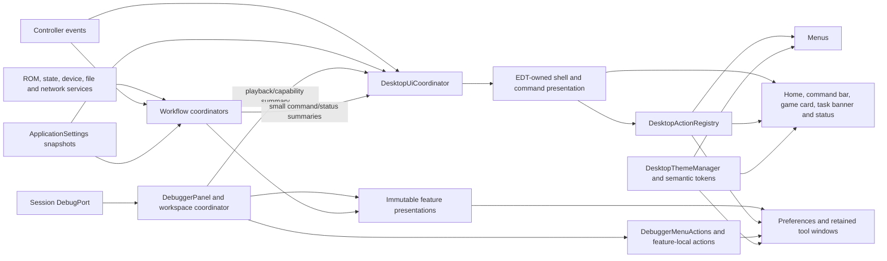

# Coffee GB desktop UI modernization proposal

**Status:** implemented for code review, July 2026; automated verification is green on
`codex/desktop-ui-modernization`, with manual platform acceptance still pending

**Target:** Coffee GB desktop, Swing

**Scope:** the complete Coffee GB desktop interface: the main emulator window, Preferences,
netplay, every dialog and retained utility window, and the navigation/window chrome of the
multi-window debugger delivered through commit `313f6a5`. Debugger data content, cadence, and
safe-point capabilities remain governed by
[`realtime-debugger-ui-proposal.md`](realtime-debugger-ui-proposal.md).

The design and audit sections below use “current” or “existing” for the `313f6a5` baseline that was
reviewed. **Implementation status**, milestone outcomes, and the readiness checklist describe the
code on this branch.

Coffee GB already has stronger desktop plumbing than its current presentation suggests. ROM
opening is asynchronous and cancellable, settings are edited as one validated draft, state
management is modeless, display changes have a shared controller, and many fields already expose
accessible names and mnemonics. The debugger already has seven retained live windows, bounded
presentation models, and coherent status. The visible shell does not bring those strengths
together: an idle launch is a black game raster, routine actions are spread across seven menus,
status is often visible only in a menu or modal alert, and related workflows use unrelated stock
prompts.

This proposal keeps Swing and the existing emulator/controller boundaries. It adds a game-first
home and play surface, shared action/command presentation plus feature-owned presentation models, a
calm light/dark visual system, a category-based Preferences window, a retained netplay session
window, and a small set of common dialog patterns. It deliberately does not turn Coffee GB into a
ROM-library manager, hide network data transfers, or claim that the opt-in protocol-v9 foundation
is the current user-facing path.

## Decision

The normal desktop experience should be **one game-first window with progressive disclosure**.
Before a game is open, the center of that window is a useful home surface with **Open ROM**,
drag-and-drop guidance, and a short recent list. During play, the emulator raster remains the
dominant content. A compact, hideable command bar outside the raster exposes Open, Pause/Resume,
Save, Load, the active state slot, Mute, Netplay, and Full Screen. It disappears in full screen and
never changes the game's pixels or scaling.

Within a command scope, menus, command-bar buttons, home actions, and dialog links must reuse the
same Swing `Action` objects. One EDT-owned immutable desktop presentation drives shell command
labels, selected states, enabled states, and status text; the debugger retains its own
capability-aware action owner for tool-local commands. This replaces today's independent listeners
and makes shortcut ownership explicit before more focusable controls are added.

Preferences remains an atomic draft rather than becoming a collection of live-mutating panels.
It moves from eight horizontal tabs to a left category list, merges keyboard and gamepad setup
under Controls, adds appearance settings, and changes the closing **Apply** button to the truthful
**Save changes**. Restore defaults becomes page-scoped by default.

`Game > Netplay...` opens one retained modeless window. Its initial Host and Join views become an
in-place session center while work is in progress or a connection is active. It exposes listening,
connecting, transfer, failure, and disconnect states without checkbox commands or red/green emoji.
For the current protocol-v8 path it prominently explains that ROM, optional slot-ROM, battery, and
state data can cross a direct, unauthenticated and unencrypted TCP connection. Protocol-v9
invitation and item-consent UI replaces this flow only after that foundation is wired into the
normal controller.

The visual baseline should use the small, Apache-2.0
[FlatLaf](https://www.formdev.com/flatlaf/) core for consistent Light and Dark modes, subject to the
normal dependency, SBOM, native-package, and license review. **Light** is the proposed default for
new and migrated installations. **System appearance** uses the JDK system look and feel and is the
fallback if FlatLaf cannot initialize. If dependency review rejects FlatLaf, the shell and workflow
work proceeds with System appearance while Light/Dark is postponed. Coffee GB keeps normal
operating-system window decorations; custom title bars and platform impersonation are out of
scope.

## Current experience and change summary

| Area | Current behavior | Proposed behavior |
| --- | --- | --- |
| Idle main window | A zero-filled black `SwingDisplay`; Open is discoverable only through the menu, drop, CLI, or OS integration | A branded empty state with one primary Open action, drop guidance, and up to five stored recent entries |
| Running main window | Game raster plus seven top-level menus; title and short raster notifications carry most status | Game raster plus a compact command bar in windowed mode; visible text states for paused, muted, active slot, netplay, and blocking work |
| Actions and shortcuts | Menu listeners own state separately; `Ctrl/Command+M` is assigned to both Manage States and Mute | One owner per command scope, conflict tests within overlapping scopes, and shared actions in every presentation of a command |
| Loading | The title changes, a glass pane blocks input, and a separate modeless progress dialog appears | A nonmodal in-window task banner states what is happening, preserves the old game visibly during replacement, and owns real cancellation; persistence recovery uses an owned decision |
| Menus | Before `313f6a5`: File, Game, Screen, Audio, Peripherals, Link, and Tools; `313f6a5` replaces Tools with a dedicated Debug menu | File, Game, View, Peripherals, Debug, and Help; Netplay joins Game, persisted global Mute is folded into Game, and Debug retains the delivered workspace navigation |
| Preferences | Eight top tabs, nested player tabs, global Restore Defaults, and an Apply button that saves and closes | Left categories, one Controls section, page reset, dirty state, and Cancel/Save changes |
| Netplay | Start/connect checkboxes, raw prompts, and a disabled emoji status item | Retained Host/Join/session window, typed lifecycle, inline validation/errors, roster, transfer disclosure, and explicit Disconnect |
| Debugger | `313f6a5` provides a top-level Debug menu, seven retained modeless windows, four layout commands, no child menu bars, and contextual shortcuts | Preserve that workflow while bringing its actions, titles, placement, themes, statuses, shortcut documentation, and accessibility into the same desktop grammar |
| Dialogs | A mix of robust custom panels, chained `JOptionPane`s, ownerless frames, and modal success messages | Shared decision, form, progress, error, and notification patterns with explicit modality and ownership |
| Appearance | JDK default look and feel plus several hard-coded colors and emoji | Semantic color/spacing/icon tokens, Light/Dark/System choices, native decorations, and no color-only state |
| Window memory | Main outer-frame width/height; the debugger separately retains seven bounds, per-window Hold, last layout, font scale, and Timeline presentation settings | Validated main bounds/maximized state and retained utility bounds while preserving the debugger's bounded feature-owned stores; no secrets, visibility, or transient content persisted |

Existing behavior that should be retained includes the unified `DesktopRomOpen` entry path, safe
configured-directory handling in `RomFileChooser`, the Preferences draft and validation model,
off-EDT device and filesystem discovery, `DesktopDisplayController`, the State Manager's modeless
split view, and detailed copyable ROM/state failures.

The audit is grounded in the current
[`SwingGui.kt`](../swing/src/main/java/eu/rekawek/coffeegb/swing/SwingGui.kt),
[`SwingMenu.kt`](../swing/src/main/java/eu/rekawek/coffeegb/swing/SwingMenu.kt),
[`SwingDisplay.java`](../swing/src/main/java/eu/rekawek/coffeegb/swing/io/SwingDisplay.java),
[`DesktopRomOpen.kt`](../swing/src/main/java/eu/rekawek/coffeegb/swing/DesktopRomOpen.kt),
[`PreferencesDialog.kt`](../swing/src/main/java/eu/rekawek/coffeegb/swing/PreferencesDialog.kt),
[`StateUxDesktopController.kt`](../swing/src/main/java/eu/rekawek/coffeegb/swing/StateUxDesktopController.kt),
[`MobileAdapterConfigurationDialog.kt`](../swing/src/main/java/eu/rekawek/coffeegb/swing/MobileAdapterConfigurationDialog.kt),
and [`SwingPrinter.kt`](../swing/src/main/java/eu/rekawek/coffeegb/swing/SwingPrinter.kt).
Current network lifecycle and endpoint limitations come from
[`ConnectionController.kt`](../controller/src/main/java/eu/rekawek/coffeegb/controller/network/ConnectionController.kt),
[`TcpClient.kt`](../controller/src/main/java/eu/rekawek/coffeegb/controller/network/TcpClient.kt),
and [`TcpServer.kt`](../controller/src/main/java/eu/rekawek/coffeegb/controller/network/TcpServer.kt).
The debugger integration baseline is commit `313f6a5`, principally
[`DebuggerWorkspace.kt`](../swing/src/main/java/eu/rekawek/coffeegb/swing/DebuggerWorkspace.kt),
[`DesktopDebuggerController.kt`](../swing/src/main/java/eu/rekawek/coffeegb/swing/DesktopDebuggerController.kt),
and the Debug menu in
[`SwingMenu.kt`](../swing/src/main/java/eu/rekawek/coffeegb/swing/SwingMenu.kt).

## Implementation status

This branch is based directly on `master` commit `313f6a5` and treats that commit's debugger
workspace as a delivered compatibility baseline, not an older UI to replace. The implementation is
substantial and reviewable now, but this document deliberately distinguishes automated delivery
from the remaining manual release gates.

Delivered in this branch:

- Schema 8 adds Light, Dark, and System appearance, command-bar visibility, and desktop window
  preferences. FlatLaf Light/Dark is packaged with System-LAF fallback, semantic theme tokens,
  shared Pocket Brew imagery, whole-window theme refresh, and updated legal inventory.
- The main frame now has Home/Game cards, one ROM-open pipeline for every entry route, a bounded
  recent-game card grid with asynchronously loaded autosave thumbnails, drag-and-drop guidance, a
  responsive shared-action command bar, an in-window task banner, and an always-visible textual
  status region. Exact 1x packs after command chrome has adopted the new presentation, and Close
  Game leaves fullscreen before revealing Home.
- Main bounds/maximized state and retained utility bounds are stored separately from emulator
  settings, validated against current monitor geometry, and never record transient content or
  utility visibility. Fullscreen native-peer recreation retains the exact visible modeless owned
  window tree and restores the same instances parent-first.
- Menus are reorganized as File, Game, View, Peripherals, Debug, and Help. Application shortcuts
  have one conflict-aware registry and gameplay input is released when menus, dialogs, text input,
  or debugger tools take focus. Help includes grouped shortcut reference and a themed About view.
- Preferences uses a category list and one atomic draft, merges keyboard/gamepad work under
  Controls for all four players, supports gamepad refresh and tuning, adds appearance, page reset,
  accurate Save changes wording, and consistent validation/focus behavior.
- Decision, form, information, detailed-error, and recovery patterns are shared and owned. ROM
  archive choice, ROM failures, lifecycle/persistence decisions, state workflows, screenshot
  outcomes, and specialist configuration flows use those patterns or nonmodal status instead of
  success-only alerts. A located recent entry is replaced in one settings transaction only after
  the replacement game commits.
- State Manager, Netplay, Mobile Adapter Configuration, and Printer are retained modeless tools
  with validated geometry and coordinated shutdown. Printer construction waits for the designated
  main owner, even when paper or a show request arrives first.
- Netplay has attempt-correlated Host/Join/session states, disclosure of current v8 transfer and
  transport semantics, serial-owner handoff/rollback, immediate attempt-scoped cancellation,
  five-second DNS/connect deadlines, stale-result rejection, and redacted endpoint/peer diagnostics.
- The seven debugger windows and four layouts from `313f6a5` retain their lifecycle, sampling,
  Hold, and safe-point contracts while adopting the desktop title, theme, zoom, placement, status,
  shortcut-help, and fullscreen-retention grammar. The shell consumes authoritative effective
  playback state rather than guessing from Pause/Resume requests.

Known follow-up and acceptance work:

- `ApplicationSettingsStore` still exposes background write failure through its health accessor
  and shutdown recovery, not a typed live shell subscription. Preferences also reports whole-store
  read-only state rather than a per-field effective-source label for command-line overrides. These
  are truthful implementation deferrals in Milestone 3; no UI claims that an asynchronous write
  has reached disk.
- Debug navigation uses one feature facade but has not yet been promoted into the same reusable
  Swing `Action` registry as Home/menu/command-bar commands. There is currently only one Debug
  navigation presentation, so this is an ownership cleanup rather than a conflicting behavior.
- JVM hostname resolution cannot be forcibly killed when a platform resolver ignores interruption.
  Coffee GB bounds the active attempt to five seconds (or immediate Cancel), quarantines late
  results, and leaves only a daemon resolver task; a process/native resolver boundary would be
  required to guarantee physical thread termination.
- Linux, Windows, and macOS package smoke, native fullscreen/file-chooser behavior, 100–200% DPI,
  screen-reader traversal, contrast inspection, and the final keyboard/accessibility matrix remain
  manual release acceptance. Protocol-v9 invitation/consent UI remains intentionally absent until
  its controller path is approved and usable end to end.

Automated verification completed on OpenJDK 21 with the Kotlin compiler daemon disabled:

- Focused shell, ROM-open, display, fullscreen, shared-dialog, printer, and authoritative playback
  contracts ran with
  `mvn -pl swing -am -Dkotlin.compiler.daemon=false -Dtest=RecentRomsTest,RomOpenServiceTest,DesktopRomOpenTest,DesktopUiCoordinatorTest,DesktopMainPanelTest,DesktopDisplayControllerTest,FullscreenControllerTest,ScreenMenuTest,DesktopDialogFactoryTest,SwingPrinterTest,DesktopPlaybackStateTest -Dsurefire.failIfNoSpecifiedTests=false test`:
  **99 tests, zero failures or errors**.
- The reviewed hardware/model decision inventory ran with
  `mvn -pl controller -Dkotlin.compiler.daemon=false -Dtest=SgbInventoryGuardTest test`:
  **2 tests, zero failures or errors**.
- The final unrestricted loopback-capable reactor ran with
  `mvn -pl swing -am -Dkotlin.compiler.daemon=false test`: core **1,080** tests (2 skipped),
  controller **869** tests (2 skipped), and Swing **628** tests, for **2,577 tests with zero failures
  or errors and four expected skips**.
- `git diff --check` reports no whitespace errors. Focused counts overlap the full reactor and are
  recorded as diagnostic evidence, not added to its total.

Unchecked criteria below are manual release gates or the explicit follow-ups above; they are not an
assertion that the rest of the delivered code is absent.

## Reference audit

The proposal combines established desktop-emulator and Swing patterns rather than copying one
application's layout.

| Reference | Pattern worth adopting | Coffee GB decision |
| --- | --- | --- |
| [SameBoy features](https://sameboy.github.io/features/) and [source](https://github.com/LIJI32/SameBoy) | Its Cocoa/macOS frontend demonstrates native desktop presentation, drag-and-drop, high-DPI support, and a play surface that remains primary | Keep Coffee GB game-first and platform-familiar across its three platforms; add a useful empty state without building a cover-art library |
| [Dolphin controller guide](https://docs.dolphin-emu.org/docs/guides/configuring-controllers/) | Controller assignment and mapping are presented as one task, with advanced device tuning nearby | Merge keyboard and gamepad categories under Controls, organized by player |
| [Dolphin NetPlay guide](https://blog.dolphin-emu.org/docs/guides/netplay-guide/) and [NetPlay UI source](https://github.com/dolphin-emu/dolphin/tree/master/Source/Core/DolphinQt/NetPlay) | Host/join setup leads into a persistent session view with players and compatibility context | Use one retained window, but disclose Coffee GB's actual direct-TCP and data-transfer semantics rather than copying traversal or matchmaking affordances |
| [DuckStation's Qt settings source](https://github.com/stenzek/duckstation/tree/master/src/duckstation-qt) | Dedicated console/emulation, display, audio, controller, and advanced settings widgets | Use a stable category list and plain explanations for hardware-profile settings |
| [mGBA](https://github.com/mgba-emu/mgba) and its [change history](https://github.com/mgba-emu/mgba/blob/master/CHANGES) | State previews, retained utility windows, and ongoing desktop action-state polish | Evolve Coffee GB's existing State Manager and Printer rather than replacing them with modal prompts |
| [FlatLaf overview](https://www.formdev.com/flatlaf/), [themes](https://www.formdev.com/flatlaf/themes/), and [customization](https://www.formdev.com/flatlaf/how-to-customize/) | HiDPI-aware Swing theming, Light/Dark modes, and central UI defaults | Use semantic application overrides over a reviewed core dependency; keep system-LAF fallback and OS decorations |
| [Oracle Swing accessibility guidance](https://docs.oracle.com/javase/tutorial/uiswing/misc/access.html) and [Java focus specification](https://docs.oracle.com/en/java/javase/24/docs/api/java.desktop/java/awt/doc-files/FocusSpec.html) | Label association, accessible descriptions, predictable focus, mnemonics, and keyboard traversal | Accessibility is part of every component contract, especially after adding focusable command-bar controls |
| [WCAG 2.2](https://www.w3.org/TR/WCAG22/) | Text/non-text contrast and state that does not depend on color alone | Apply the relevant visual guidance to Swing themes and custom renderers; do not claim web conformance for a desktop application |
| Coffee GB's [Pocket Brew icon kit](../packaging/resources/icons/README.md) | An existing espresso, oat, sage, coffee, rust, and cream identity | Use the mark and restrained brand accents on the home/about surfaces; derive accessible semantic colors instead of applying raw brand values everywhere |

The intended character is warm but quiet: recognizable on first launch, unobtrusive while a game
is running, and consistent with Windows, macOS, and Linux rather than styled like a web dashboard.

## Experience principles

1. **The game is the product.** Chrome supports opening, playing, and recovering a game; it does
   not compete with the raster.
2. **One action has one owner.** Every invocation of Pause, Save, Mute, or Netplay shares command,
   enablement, selection, shortcut, and accessible text.
3. **Show the next useful step.** Empty, busy, failed, and disconnected states provide an obvious
   action without forcing the user to inspect a menu.
4. **Use progressive disclosure.** Common choices are immediate; hardware profiles, protocol
   details, device tuning, and diagnostics remain available with explanations.
5. **Never disguise asynchronous work.** Opening, persistence, device discovery, connection, and
   export show visible activity and a terminal outcome; progress and cancellation appear only when
   those contracts are real.
6. **Reserve modality for decisions.** Tools and session monitors are modeless; a modal dialog is
   used only when the application cannot safely continue without a choice.
7. **Be literal about privacy and capability.** Network transfers, plaintext transport, unsupported
   profiles, and unavailable protocol features are stated before the consequential action.

## Main-window model

### Composition

The frame content becomes a `BorderLayout` containing an optional command bar and a `CardLayout`
with **Home** and **Game** cards. ROM opening and session-level persistence barriers use one inline,
nonmodal task banner attached to that content. It disables only conflicting session mutations and
does not move focus; an owned decision dialog appears only when persistence requires a choice.
Short state-operation confirmations continue to use the raster notification mechanism while a game
is visible; the Home card uses an equivalent accessible status region.

Idle:

```text
+------------------------------------------------------------------+
| File  Game  View  Peripherals  Debug  Help                       |
|                                                                  |
|                         [Pocket Brew mark]                       |
|                            Coffee GB                             |
|                         [ Open ROM... ]                          |
|                    or drop a ROM/archive here                    |
|                                                                  |
| Recent                                                           |
| [saved frame] Pokemon Crystal.gbc    [saved frame] Tetris.gb      |
|               ~/Games/Game Boy/                    ~/Games/       |
+------------------------------------------------------------------+
```

Playing:

```text
+------------------------------------------------------------------+
| File  Game  View  Peripherals  Debug  Help                       |
| [Open] [Pause] [Save] [Load] [Slot 0 v]   Muted  Netplay: Off [⛶]|
|+----------------------------------------------------------------+|
||                                                                ||
||                  aspect-fit game raster                        ||
||          nearest-neighbor pixels and letterbox only            ||
||                                                                ||
|+----------------------------------------------------------------+|
| Opening Pokemon Crystal.gbc...                         [Cancel]   |
+------------------------------------------------------------------+
```

The Home card does not need a command bar: its primary action is already central, and game-only
commands are inapplicable. The diagram's symbols are illustrative only. Production buttons use the
shared icon set plus text/tooltips and accessible names; status never depends on a glyph. While a
game is loaded, the command bar is outside the rendered raster, visible by default in windowed
mode, hideable from View, and always hidden in full screen. At narrow widths, lower-frequency
actions move to an accessible overflow menu; the raster does not become smaller than its supported
minimum solely to preserve the bar.

### Presentation state

One immutable shell `DesktopPresentation` is applied on the EDT. It composes a session,
session-level activity, playback state, compact netplay/peripheral summaries, one durable optional
`DesktopNotice`, and a `DesktopCommandState`. The command slice contains active state
slot/availability, persisted mute,
display/fullscreen selections, serial ownership/capabilities, and retained-tool availability so
actions do not fall back to raw listeners. It is assembled from typed settings and feature
snapshots. The presentation is not a global task registry: State export, Printer save, Preferences
discovery, Netplay connection work, Mobile Adapter work, and debugger capture keep immutable task
state in their existing or dedicated workflow coordinators and expose only the summaries needed by
shared actions or the shell.

| Dimension | States the UI must represent | Visible consequence |
| --- | --- | --- |
| Session | Empty, Game loaded, Closing | Home or Game card; ROM title; actions enabled only when meaningful |
| Session activity | Idle, Opening, Persisting before replace/close, Stopping, Failed | Task banner with exact target and real Cancel; a blocking failure opens the owned Retry/Keep decision |
| Playback | Running, Paused | Pause action relabels to Resume; a persistent text badge accompanies any visual treatment |
| Commands/capabilities | Active slot, mute, display selections, serial owner, available retained tools | Shared actions receive selected/enabled/label state without individual event subscriptions |
| Netplay | Disconnected, Starting host, Waiting, Connecting, Negotiating, Active, Stopping, Failed | Command-bar summary and complete detail in the retained Netplay window |
| Notice | Informational, Warning, Action failed | Timed notification for routine results; persistent inline issue when user action is required |

Impossible shell combinations are rejected in the coordinator. Replacing a game is represented as
the current loaded session plus an Opening session activity, so the old game remains visible until
the new configuration commits. A failed open returns to that exact session instead of briefly
presenting an empty or half-loaded state. Feature coordinators retain their own existing request IDs
or generations; `DesktopUiCoordinator` does not renumber or serialize unrelated background work.

### Home surface

The Home card contains no folder scanner, database, cover download, or play-time tracking. It
uses the existing recent-file list and its configured capacity, showing at most five cards with an
autosave thumbnail, filename, and elided parent directory. The thumbnail is the hash-bound image
already saved beside a valid autosave; a missing or legacy thumbnail gets a neutral **No preview**
card rather than a misleading substitute. Reads run off the EDT, and a corrupt or incompatible
active autosave never falls through to an older fallback preview. When recents are disabled or
empty, the section is absent. Activating a missing entry offers **Remove from Recent** or **Locate
File...** without silently deleting it. Startup does not synchronously probe every recent path: a
stale network location must not freeze the EDT merely to decorate the Home card.

Locate File selects a candidate through the same correlated ROM-open pipeline. It replaces/removes
the stale recent entry only after that candidate commits successfully; Cancel, validation failure,
or open failure leaves the original history available.

The whole central drop target uses the existing unified ROM-open pipeline and supported
`.gb`, `.gbc`, `.rom`, `.zip`, and `.7z` behavior. Drop feedback uses a theme focus/accent token,
not a hard-coded color. The primary button, `File > Open ROM...`, recent entries, OS open-file
events, CLI paths, and drops continue to converge on the same service.

### Game surface and window behavior

The renderer remains an aspect-fit, nearest-neighbor pixel surface with the existing rotation,
letterbox, Super Game Boy border, grayscale, blending, and correction behavior. Theme colors must
not tint, smooth, round, shadow, or otherwise alter the emulated image. Full screen contains the
raster, transient operation notifications, and minimal persistent text for Paused or an actionable
session/netplay failure; it has no menu or command bar. The same status is exposed through the
accessible main-window status value. Escape and the Full Screen action return to the previous
validated window bounds.

The 1x/2x/4x commands set the rotated framebuffer viewport to that exact integer multiple; menu and
command-bar dimensions are added outside it. At an exact 1x window the bar is temporarily hidden.
At wider sizes, priority is Pause/Resume, Save, Load, slot, then Open, Mute, Netplay, and Full Screen;
items that do not fit move to a labelled keyboard-accessible overflow menu. Manually widening the
1x window can reveal the bar without rescaling the viewport.

The title is `Game title — Coffee GB` while loaded and `Coffee GB` while idle. Temporary verbs such
as “loading” do not replace identity in the title. A restored main window remembers normal bounds
and maximized state, rejects off-screen or implausibly small geometry after monitor changes, and
continues to cooperate with `DesktopFullscreenRuntime` recreating the native peer.

Closing a running game is labeled **Close Game**, not Stop Server or an ambiguous checkbox. It uses
a session-close persistence and confirmation barrier ending in the existing stop-emulation
command. Quit composes that reusable session barrier with process-wide tool/settings disposal; it
does not route Close Game through `DesktopShutdownCoordinator` itself. A timeout or failed autosave
never makes the window disappear silently.

## Menus, commands, and shortcuts

Six top-level menus keep the hierarchy broad enough for specialist devices without leaving a
one-command Audio or generic Tools menu. The realtime debugger proposal remains authoritative for
debug data, capabilities, cadence, and tool content; this proposal preserves its delivered window
model and defines how its navigation and chrome join the whole desktop grammar.

| Menu | Contents |
| --- | --- |
| **File** | Open ROM..., Open Recent, Close Game; Open Save Folder; Preferences...; Quit |
| **Game** | Pause/Resume, Reset; Save State, Load State, State Slot, Manage States...; Cheats...; Netplay...; Mute |
| **View** | Full Screen, Show Command Bar; Window Size; Rotation; Grayscale, frame blending, color correction, SGB border; Screenshot; More Display Settings... |
| **Peripherals** | Camera; Link-Port Device with attachment status; device-specific Configure/Open actions; Action Replay Slot...; Full Changer...; Barcode Boy... |
| **Debug** | Execution, Memory, Breakpoints, Video, Hardware & I/O, Audio, Timeline, and built-in layouts, following the debugger proposal; always available, with each tool showing its typed no-session/unsupported state |
| **Help** | Keyboard Shortcuts; About Coffee GB |

Submenus reflect capability. For example, **Configure Mobile Adapter...** is enabled only when its
configuration is meaningful, but choosing another link device does not erase saved policy. The
active device appears as text plus a selected menu item. Unknown or disconnected state is not
shown as a green/red dot.

Mute remains the persisted global master-audio setting, not a per-game session flag. It stays
available while idle through the Game menu and Audio Preferences; the command-bar affordance is
simply its convenient in-game presentation.

`DesktopActionRegistry` creates each command once. It receives presentations, invokes controller
facades, and supplies name, selected value, icon, tooltip, mnemonic, accelerator, and accessible
description. Menu items and buttons never add a second controller listener. Radio groups such as
state slot, scale, rotation, and serial device are typed action groups rather than manual mutual
exclusion.

The initial shortcut vocabulary is deliberately small:

| Action | Proposed default |
| --- | --- |
| Open ROM | Platform menu shortcut + O |
| Preferences | Platform menu shortcut + comma |
| Quit | Platform menu shortcut + Q |
| Pause/Resume | Space, outside text entry and key-capture UI |
| Reset | Platform menu shortcut + R |
| Save/Load current slot | F5 / F7 |
| Select state slot 0–9 | Platform menu shortcut + 0–9 |
| Manage States / Mute | No default; both remain in menus and the command bar where applicable |
| Full Screen / Screenshot | F11 / F12 when not assigned to gameplay |
| Close Game | No destructive default accelerator |

This removes the current duplicate `Ctrl/Command+M` assignment and avoids using the conventional
Save shortcut for Close Game; it also avoids macOS's Command+M Minimize shortcut. Modified platform
commands belong to the application and never also reach gameplay. For every unmodified default
(Space, F5, F7, F11, or F12), a user's gameplay binding wins and the corresponding application
accelerator automatically withdraws until that binding changes. Menus and command-bar buttons stay
available and the Controls/Shortcuts views explain why the shortcut is inactive. This one policy
replaces the current F11-only special case. `DesktopShortcutRegistry` rejects duplicate application
commands and the Keyboard Controls page shows fixed runtime controls such as rewind and tilt until
they become truly editable.

The same gameplay-wins rule covers today's fixed runtime keys. If Backspace is assigned to a
joypad, rewind withdraws from Backspace; if I/J/K/L is assigned, the corresponding tilt key
withdraws. Controls and the Shortcuts table show that effective precedence, legacy collisions are
migrated deterministically, and tests prove one physical key press never performs both actions.

Context navigation is the narrow exception: Escape cancels an open dialog/menu and exits full
screen, and Enter activates a focused safe default. An Escape/Enter joypad binding works only when
the game surface owns that context; Controls explains the override, and transition into the
dialog/menu/full-screen Escape context releases any latched gameplay press first.

Adding accessible focusable buttons exposes a current input flaw: game keys are listened for on
the frame, so focus in a child can lose key delivery. A scoped `DesktopInputRouter` is a prerequisite
for the command bar. It handles press and release while the game window is active, but yields to
text components, menus, dialogs, keyboard-capture controls, and platform-modified command
shortcuts. Whenever focus leaves game scope, precedence changes, bindings change, or ROM/controller
ownership changes, it releases every latched joypad, rewind, and tilt input before yielding. Making
toolbar controls non-focusable is not an acceptable workaround.

## Debugger integration after `313f6a5`

### Preserved workspace model

Commit `313f6a5` is the debugger-navigation baseline, not an intermediate design to undo. The main
frame's **Debug** menu is the sole global entry point:

```text
Debug
├── Execution
├── Memory
├── Breakpoints
├── Video
├── Hardware & I/O
├── Audio
├── Timeline
└── Layout
    ├── CPU debugging
    ├── Graphics debugging
    ├── Timing and I/O
    └── Full workspace
```

The menu remains present and enabled without a loaded ROM. Opening a tool in that state creates or
raises the retained window and shows its existing explicit no-session/capability state; disabling
the menu or individual tool navigation would hide useful discoverability and diagnostics.

The first Debug command lazily creates exactly one retained `DebuggerWindow`, its one shared
`DebuggerPanel`/inspection stream, and all seven owned dialogs. A session already published by the
controller is applied before the requested tool is revealed. Every later Show/Raise or Layout
action routes through that same `DesktopDebuggerController`; none constructs an independent view.
The eleven menu items are ordinary navigation actions, without visibility checkmarks or global
accelerators.

| Workspace behavior | Unified desktop contract |
| --- | --- |
| Selecting a tool | Show or raise exactly that retained window and leave other visible debugger windows unchanged |
| Applying a built-in layout | Replace the visible debugger set with the layout's exact tools and tile/cascade only those tools; never move or resize the emulator frame |
| Closing a tool decoration | Hide that window, withdraw its inspection interest, and retain its instance for the next Debug command |
| Child-window menus | Keep no menu bar, as delivered in `313f6a5`; global discovery belongs to the main Debug/Help menus and contextual actions belong to visible controls/shortcuts |
| Startup | Open no debugger windows automatically; visibility and inspected content are session state, not restart state |
| Persistence | Retain validated per-window bounds, per-window Hold, shared debugger font/trace presentation choices, and the selected built-in layout; never persist visibility, snapshots, memory, trace rows, paths, copied values, or session capability data |
| Sampling | Visible, non-held tools express interest; hidden or held tools withdraw it. Theme/window work must not change the bounded 20 Hz scalar or 10 Hz graphics contracts |
| Shutdown | The one `DesktopDebuggerController` disposes the retained workspace once; debugger windows never own or close the session's `DebugPort` |

The built-in layouts retain their exact delivered membership:

| Layout | Visible tools after applying it |
| --- | --- |
| **CPU debugging** | Execution, Memory, Breakpoints |
| **Graphics debugging** | Execution, Video, Hardware & I/O |
| **Timing and I/O** | Execution, Hardware & I/O, Timeline |
| **Full workspace** | All seven tools |

Debugger windows use the same content-first title grammar as other retained windows:
`Execution — Coffee GB`, `Netplay — Coffee GB`, `States — Coffee GB`, and so on. They remain owned
modeless dialogs with normal OS decorations. Bounds are restored only when they materially
intersect a current screen; a built-in layout uses the shared usable-screen/clamping policy and
falls back to a bounded cascade when tiling would make a tool smaller than its minimum.

Full screen suppresses only main-frame chrome. It does not apply a debugger layout or change tool
visibility, Hold, bounds, or second-monitor placement. `DesktopFullscreenRuntime` peer recreation
must preserve the same workspace and owners without hiding, disposing, duplicating, or newly
persisting debugger visibility.

### Actions and contextual shortcuts

The main menu currently consumes one `DebuggerMenuActions` facade for the seven Show/Raise commands
and four Apply Layout commands. The retained tools keep feature-local capability-sensitive actions.
Promoting both scopes into reusable registries equivalent to `DesktopActionRegistry` is a recorded
ownership cleanup; there is only one Debug navigation presentation today, so no duplicate command
execution is introduced. The contextual commands remain:

| Debugger action | Contextual shortcut |
| --- | --- |
| Pause/Resume | F6 |
| Step instruction / Step frame | F7 / Shift+F7 |
| Back instruction / Back frame | F8 / Shift+F8 |
| Toggle breakpoint at current PC | F9 |
| Copy current tool | Platform menu shortcut + C |
| Increase / decrease / reset debugger font | Platform menu shortcut + equals / minus / 0 (equals is the delivered zoom-in key) |
| Hold updates | Per-window labelled checkbox/action; no hidden default shortcut |

Toolbar buttons, key bindings, tooltips, accessible descriptions, and any future context menu reuse
these actions. Their enabled state comes from the immutable debugger capability/presentation model;
the actions do not probe Swing widgets and trigger `doClick()` on another control. Main Pause and
debugger run control keep their distinct controller authority, but both consume the same published
playback result so a step, reverse command, breakpoint, or ordinary Pause cannot leave the main
shell saying Running while a debugger says Paused.

Shortcut ownership is window-contextual rather than globally unique. In the active main emulator
window F7 is Load State unless a gameplay mapping withdraws it; in an active debugger window F7 is
Step instruction; in a modal/form context it has no emulator meaning. The main gameplay input
router releases all latched input when focus moves to a debugger window and never forwards joypad,
rewind, or tilt keys while that window is active. **Help > Keyboard Shortcuts** groups Main window,
Gameplay, and Debugger window contexts so the deliberate F7 reuse is visible rather than reported
as a global collision.

F5 deliberately has no debugger meaning because the workspace has no Refresh command. Tool-local
bindings remain local as well: in Breakpoints, Enter edits the selected row and platform menu
shortcut + F focuses its filter. A numpad-plus zoom alias is not implied by the delivered equals
binding; it can be added only with explicit cross-platform conflict and key-map tests.

### Shared visual and accessibility contract

FlatLaf/System changes are global and update every created debugger window, visible or hidden, on
the EDT along with the main frame, Preferences, and retained utilities. A theme change preserves
tool content, Hold, font scale, selection, bounds, focus where possible, and sampling state.
Borders, renderers, and custom-paint colors captured from `UIManager` at construction are
recomputed rather than relying on component-tree refresh alone. `DebuggerFontScaler` and
`DebuggerPeripheralFontScaler` recapture their new-LAF font, row-height, and column-width baselines
and then reapply the saved zoom, so a later zoom cannot restore old-theme metrics. Debugger tables
may use a compact density token, but they use the same UI font family, spacing scale, focus ring,
border, selection, error, warning, and status tokens as the rest of the application.

The Pocket Brew mark and warm decorative accents stay on Home/About; dense engineering windows do
not receive branded backgrounds. Hardware pixels, tile/map/object colors, palettes, Wave RAM plots,
and semantic value colors retain their data meaning and are never theme-tinted. Debugger font zoom
continues to compose with platform DPI scaling rather than replacing it.

The state bar uses text **LIVE** or **HELD** plus semantic redundant styling. Paused/Running,
snapshot identity, unsupported capability, stale-result rejection, and inspection failure remain
in a persistent selectable/accessible footer rather than producing modal alerts or transient main
window notifications. Because the child windows have no menus, every shortcut also has a labelled
or tooltip-described visible action where one exists, and the grouped Help table supplies the
complete keyboard reference. Custom Video canvases retain their adjacent textual tables and
keyboard selection.

Debugger-specific safe presentation state remains in `DebuggerWorkspacePreferencesStore` and
`DebuggerPreferencesStore`; it is not folded into `ApplicationSettings` or the general
`DesktopUiStateStore`. The existing `debugger-workspace-v2` and `debugger` preference nodes remain
authoritative and reuse `DesktopWindowPlacement` validation and theme-independent geometry rules.
Global theme is an application setting, while debugger font scale, Hold, trace
categories/capacity, and built-in layout remain feature-owned. Moving these values to another
store is unnecessary; any later migration must be atomic and verified before removing obsolete
keys, and must not reset a user's bounds, Hold, font, trace, or layout choices.

## Visual system

### Theme and brand

Preferences offers **Light**, **Dark**, and **System look and feel**. Light and Dark use reviewed
FlatLaf core themes; System uses `UIManager.getSystemLookAndFeelClassName()`. Light is the explicit
default for a new settings document and the schema-7 migration, intentionally replacing the
current JDK Metal default. System is available for native OS styling; it is not described as
preserving the old look. Failure to load a selected theme falls back to System for that launch,
records a sanitized diagnostic, and shows one non-blocking warning without overwriting the user's
choice. A theme is installed before constructing Swing components at
startup. After **Save changes**, all owned and retained windows update together on the EDT and
preserve selection, focus where possible, bounds, and model state; the Preferences draft itself
shows a bounded token-based sample card/swatches rather than attempting an alternate live LAF
subtree or mutating the whole application before Save.

The Pocket Brew mark appears on Home and About. Espresso, oat, sage, coffee, rust, and cream are
source colors, not direct UI roles. `DesktopThemeTokens` derives and tests semantic values such as
surface, elevated surface, primary text, secondary text, border, focus, accent, success, warning,
and danger for both themes. Rust may identify a primary action or focus detail only when its text
and adjacent contrast pass the selected accessibility thresholds. The game letterbox color stays
a user display setting, separate from theme surfaces.

Coffee GB uses the platform UI font and metrics. A small spacing scale and normal LAF control
heights replace fixed pixel padding; no bundled novelty font is introduced. Icons are a coherent
single-color set pre-rendered from reviewed vector sources at build time and selected for the
active scale. Runtime `FlatSVGIcon` would require a separate `flatlaf-extras` dependency and review;
FlatLaf core alone is not assumed to provide it. Icons supplement labels and tooltips and never
encode state alone. Emoji are not application icons.

### Component grammar

- one filled primary button per decision surface;
- normal buttons for safe secondary actions and text links only for navigation/help;
- sentence-case labels and action verbs, with ellipses only when another choice follows;
- section headings and short helper text instead of etched titled-border grids;
- inline validation directly below or beside its field;
- text badges for persistent session state, with shape/icon/color as redundant cues;
- compact tables only for genuinely tabular data, with sortable columns where sorting is useful;
- no custom painting where a standard accessible Swing component can express the same control.

The existing hard-coded error, gray panel, paper, and OSD colors are migrated to semantic tokens.
The raster notification background remains deliberately high contrast in both themes and exposes
the same message through an accessible status region.

## Preferences window

Preferences remains an owned application-modal `JDialog` so one atomic draft cannot become stale
while several application windows edit the same document. It is resizable, remembers validated
bounds and the last category in bounded desktop UI state, and scrolls the selected page rather than
forcing the whole dialog past the screen edge.

```text
+-----------------------------------------------------------------------+
| Preferences — Coffee GB                                               |
| General            | General                                          |
| Display            | Appearance                                       |
| Audio              | Theme  ( Light v )                               |
| Controls           |                                                  |
| Saves & Rewind     | Files and startup                                |
| System             | Default ROM folder  [ ... ]                      |
| Peripherals        | Recent games       [ 10 ]                        |
|                    | Confirm before replacing a game [ While running ]|
|--------------------+--------------------------------------------------|
| [Restore page defaults]           Unsaved changes  [Cancel] [Save changes]|
+-----------------------------------------------------------------------+
```

Seven categories are few enough that first release does not need search. Every menu deep link
selects the relevant category and field, such as **More Display Settings...** or **Configure
Controls...**. If future categories make scanning measurably difficult, search can be added over a
central label/help catalog without changing editor ownership.

### Category model

| Category | Contents and changes |
| --- | --- |
| **General** | Appearance theme; default ROM directory; recent capacity; replace/close confirmation policy. Read-only-settings or CLI-override state appears as a page banner, not only after Save. |
| **Display** | Window size command, letterbox color with accessible preview/value, start full screen, rotation, grayscale, frame blending, CGB correction, and SGB border. Live menu state still comes from `DesktopDisplayController`. |
| **Audio** | Output device, mute, volume, and latency. Discovery stays cancellable/off-EDT; unavailable saved devices are explained rather than silently replaced. |
| **Controls** | Player 1–4 selector; Keyboard and Gamepad subpages; visual Game Boy button grouping; device assignment, capture, dead zones, axis inversion, and refresh. Advanced tuning is collapsed initially. |
| **Saves & Rewind** | Data directory, battery policy for the next game, rewind enable/duration/memory estimate, autosave, and resume policy. Consequences are described in plain language. |
| **System** | DMG/CGB hardware profile and bootstrap behavior, grouped as advanced compatibility options with the current effective choice and short explanations. |
| **Peripherals** | Camera device plus the current Mobile Adapter Offline/Custom Server summary and a **Configure Mobile Adapter...** deep link. The owner-only policy remains in its dedicated hardened store; runtime authorization remains outside Preferences. |

Controls extracts and reuses the capture/validation model from the keyboard editor and the
assignment/catalog/tuning model from the gamepad editor; their current panel layouts are not
dropped wholesale into a new shell. A shared player selector replaces the keyboard editor's four
nested player tabs and the gamepad editor's four assignment rows while preserving duplicate-key,
focus, and asynchronous-catalog behavior. Each player card shows both assignments and effective
device status. Automatic assignment is described as automatic, not as an unnamed device.

There is no catch-all Debugger Preferences category in the first release. Global theme and scaling
semantics already apply to debugger windows, while debugger font scale, timeline categories and
capacity, and per-window Hold remain close to the retained workspace that owns them. The grouped
Keyboard Shortcuts dialog and Debug window tooltips make those feature-local controls discoverable
without duplicating mutable state in Preferences.

### Editing contract

- The individual editors own widget drafts. `PreferencesEdit` remains their immutable validated
  output and applies to the latest settings document, preserving hidden and unknown keys.
- **Save changes** is enabled only when the widget drafts differ from their opening baseline. A
  submission validates all pages, selects and focuses the first invalid field, atomically updates
  the latest in-memory settings document, applies runtime effects, schedules the existing
  debounced crash-safe background write, and closes after that in-memory commit is accepted.
- **Cancel**, Escape, and the window close button discard the draft. If it is dirty, one owned
  decision offers **Discard changes** or **Keep editing**.
- **Restore page defaults** changes only the current draft page and does not persist immediately.
  **Restore all Preferences defaults...** is a secondary action that resets every Preferences
  draft page after confirmation. It does not clear `DesktopUiStateStore` geometry or the
  debugger-owned layout, Hold, font, and trace preferences.
- Directory checks and device discovery remain off the EDT, cancellable on close, and guarded by
  generation so late results cannot update a reopened dialog.
- A synchronous validation/update rejection keeps the draft and dialog open. A later background
  write failure cannot truthfully roll back already active settings. This branch exposes that state
  through `ApplicationSettingsStore.lastWriteFailure()` and shutdown recovery; a typed live shell
  subscription and persistent warning remain follow-up work. A later update or final flush uses the
  store's existing retry behavior. Disk-success-before-close is not claimed; it would require a
  separate staged, revision-correlated persistence API.
- When the settings document is read-only because it is newer or could not be preserved,
  Preferences presents whole-store session-only behavior. Per-field read-only labels naming the
  effective source of individual CLI overrides remain follow-up work.

Appearance and command-bar visibility are user choices and require a normal `ApplicationSettings`
schema migration (from schema 7 if no intervening migration lands). Last category and validated
geometry for the main frame (normal bounds and maximized state), Preferences, Netplay, States,
Mobile Adapter Configuration, and Printer belong in a small versioned, bounded
`DesktopUiStateStore`, following the debugger workspace's harmless window-state precedent rather
than mutating public settings whenever a window moves. On first migration with no valid UI-state
geometry, the existing schema-7
`desktop.windowSize` seeds a centered normal **outer-frame** size; it must not be reinterpreted as
content geometry, which would enlarge the migrated window. The new store then owns placement and
maximized state. The legacy field remains readable until downgrade/compatibility policy explicitly
removes it. Invitation tokens, clipboard contents, network payload details, open dialogs, draft
values, errors, and notifications are never persisted in either store.

## Netplay window

### Current protocol-v8 experience

The first production redesign targets the protocol that normal users actually invoke today:
[protocol v8](netplay-protocol-v8.md). It does not place the opt-in v9 adapters behind polished
controls and imply they are ready.

`Game > Netplay...` opens a retained modeless window. Closing its decoration hides it; it does not
disconnect. The Game menu and command-bar status reopen it. Only **Stop hosting** or **Disconnect**
ends an active session, subject to normal bounded shutdown.

Before Host or Join is enabled, a typed preflight checks that a game is loaded and its hardware
profile is representable by protocol v8/StateFile v1. Current `dmg`, `cgb`, and `cgb0` sessions can
proceed; `mgb`, `sgb`, and `sgb2` receive the existing exact incompatibility explanation and an
action to open System settings that also says the game must be reopened under a compatible
profile. Netplay takes exclusive peer-to-peer link-port ownership. If Printer, Barcode Boy, Mobile
Adapter, or another serial device is attached, the start action names
what will be detached or disconnected, runs the bounded persistence/ownership handoff off the EDT,
and either commits the new owner atomically or leaves the previous owner/session intact. Merely
opening Netplay changes no ownership.

Disconnected host view:

```text
+------------------------------------------------------------------+
| Netplay — Coffee GB                                              |
| [ Host ] [ Join ]                                                |
|                                                                  |
| Game       Pokemon Crystal                                       |
| Mode       (o) 2-player link   ( ) 4-player adapter              |
| Port       6688  (fixed by the current protocol UI)              |
|                                                                  |
| Data sent and received                                           |
| Each peer can send its primary ROM, attached slot ROM, battery   |
| data, and a state checkpoint for its linked player. Traffic is   |
| direct TCP: it is not encrypted or peer-authenticated.           |
| Hosting listens on all local interfaces, subject to the firewall.|
| Use a trusted LAN or separately secured tunnel.                  |
|                                                                  |
|                                                [ Start hosting ] |
+------------------------------------------------------------------+
```

Join replaces the mode controls with **Address** and an inline example. Before enabling **Join
game**, it states that the local ROM, optional slot ROM, battery, and checkpoint may be sent for the
local player, while corresponding peer data can be received to construct other linked players.
The endpoint parser accepts the syntax that has explicit controller tests. The first milestone
supports hostname/IPv4 and optional port; bracketed IPv6 is enabled only after parsing, display,
connect, and diagnostic-redaction tests exist. The UI must not advertise a form the current
`host:port` parser cannot safely handle.

The 4-player choice says that the host listens for up to three peers and explains player
assignment. The port remains 6688 until the controller supports a typed configurable endpoint;
presenting an editable field that is ignored would be worse than showing the actual value.
The host view explains that Coffee GB does not discover a public address, open a firewall, configure
a router, provide relay/traversal, or decide which LAN/VPN interface a peer can reach. **Show local
addresses** may enumerate bounded interface addresses off the EDT for explicit reveal and copy,
but those addresses do not enter logs, persisted UI state, or default diagnostics.

### Session center

Starting or joining transitions in place rather than closing a prompt:

```text
+------------------------------------------------------------------+
| Netplay — Waiting for players                                    |
| Host · 4-player adapter · Port 6688                              |
|                                                                  |
| Player 1   This computer                         Ready            |
| Player 2                                         Connected        |
| Player 3   Waiting...                                              |
| Player 4   Waiting...                                              |
|                                                                  |
| The v8 connection is direct, unencrypted, and unauthenticated.    |
| [Copy sanitized details]                       [ Stop hosting ]   |
+------------------------------------------------------------------+
```

The window represents **Starting host**, **Waiting for peers**, **Connecting**, **Negotiating**,
**Synchronizing game**, **Active**, **Stopping**, and **Failed**. Each phase has one primary next
action. Cancellable phases offer Cancel; Active offers Disconnect; Failed offers **Try again** and
**Edit connection**. Bind, DNS, rejection, compatibility, timeout, protocol, and peer-disconnect
failures remain inline with expandable sanitized details instead of collapsing to “Disconnected”
or generating repeated modal alerts.

The roster shows only information the controller actually knows. Transfer progress is shown only
after byte-count events exist; until then **Synchronizing game...** is indeterminate. The endpoint
display is sanitized, selectable, and omitted from generic diagnostics unless the existing privacy
policy permits it. No ROM path, battery content, state bytes, or remote-controlled markup enters a
label, title, log, or copied report.

### Controller prerequisite

The existing boolean menu events are insufficient for a reliable session center. The network
controller should publish a correlated immutable presentation boundary such as:

```kotlin
data class NetplaySessionSnapshot(
    val generation: Long,
    val availability: NetplayAvailability,
    val phase: NetplayPhase,
    val role: NetplayRole?,
    val mode: NetplayMode?,
    val localPlayer: Int?,
    val occupiedPlayers: Set<Int>,
    val endpoint: SanitizedEndpoint?,
    val progress: NetplayProgress?,
    val failure: NetplayFailure?,
)
```

Start, cancel, and stop requests carry a generation/request identifier. Server bind failure, client
resolution/connect failure, peer rejection, and normal stop must all terminate the matching
generation exactly once. UI state is applied on the EDT; socket and protocol work never moves
there. A late callback from an old attempt cannot overwrite a new attempt or reconnect a hidden
window. Client resolution/connect becomes bounded and genuinely cancellable: the controller owns
the pending resolver/socket before blocking work starts, cancellation closes it, and an old worker
is quarantined even if the platform resolver returns late. Until that contract exists, the UI must
not show a Cancel control that cannot stop the attempt.

### Protocol-v9 evolution

The [v9 foundation](netplay-v9-foundation.md) and
[privacy model](netplay-v9-privacy.md) provide useful future presentation adapters, but the
repository explicitly describes them as opt-in and not connected to normal netplay. When that
changes, Host can expose one **Copy/Reissue invitation** action and state for each open guest slot
(slot 1 in normal mode and slots 1–3 in four-player mode); Join accepts exactly one slot-bound
invitation. The full host secret is rendered or copied only by an explicit user action, is never
placed in a title, diagnostic, recent list, setting, or log, and the join field is cleared after
ownership transfers.

V9's item manifest must precede distinct, explicit decisions for ROM, slot ROM, battery, and state
where offered. The UI never turns a mismatch into blanket consent. It must continue to say that
v9 TCP is plaintext: invitation authentication is not encryption, server identity, matchmaking,
relay, NAT traversal, or public-Internet hardening. Those controls remain absent until their
backend contracts and security review exist.

## Dialog and retained-window system

### Common grammar

`DesktopDialogFactory` and small workflow-specific coordinators provide a common shell; they do
not reduce every workflow to a generic message box.

| Pattern | Use | Behavior |
| --- | --- | --- |
| **Decision dialog** | Replace/close/quit, destructive clear/delete, discard draft, consent | Application- or document-modal, owned, concise consequence, outcome verbs, safe default, Escape cancels |
| **Form dialog** | Named state, manual cheat, barcode, attachment setup | Labels and help tied to fields, validation inline, primary action disabled until syntactically valid |
| **Progress surface** | ROM open, persistence, export, network start/stop | Modeless in-window banner or retained-window state; Cancel only when cancellation is supported |
| **Error panel** | ROM/state/settings/network/device failure | Human summary, recovery actions, expandable sanitized details, Copy details; literal untrusted text |
| **Transient notification** | State saved/loaded, screenshot or export success, device attached | Non-modal and timed; it contains no sole recovery action. Any useful follow-up also remains in a persistent status/tool surface. |
| **Retained tool window** | States, Netplay, Mobile Adapter Configuration, Printer, debugger windows | Modeless, owned or explicitly lifecycle-bound, remembered valid bounds, menu action raises existing instance |

Buttons name outcomes: **Save and open**, **Open without saving**, **Keep playing**, **Disconnect**,
or **Delete state** rather than Yes/No. The primary action is the default only when pressing Enter
cannot cause surprising destruction. Escape maps to the safe cancel/close action. After close,
focus returns to the control that opened the surface when it still exists.

Only synchronous validation caused by the user's current submission may select a page and move
focus to an invalid field. A late device, network, persistence, or worker result updates a
persistent accessible status and never steals focus from gameplay, text entry, or another dialog.
An actionable notice remains until dismissed or exposes the same action in a stable menu/tool
surface; its only button never vanishes on a timer.

Every window has an owner or an explicit application-lifecycle owner, so it cannot hide behind the
main frame and is disposed during shutdown. Modeless tools remember validated bounds; short
decisions do not. Text supplied by a path, ROM, archive, peer, printer job, or error is inserted as
literal component text, never interpreted as HTML. Detailed diagnostics use the repository's
redaction rules and a bounded selectable text area.

### Workflow inventory

| Workflow | Proposed surface and behavior |
| --- | --- |
| Open ROM chooser | Keep `RomFileChooser` and unified async service initially. Evaluate FlatLaf's [system file chooser](https://www.formdev.com/flatlaf/system-file-chooser/) only if it preserves filters, archives, stale/network-directory safety, and platform packaging. |
| Recent file missing | Inline Home/recent decision or owned dialog with Locate File..., Remove from Recent, and Cancel. |
| Replace, Close Game, Quit | One lifecycle decision vocabulary driven by confirmation/autosave policy; failure remains open with Retry, skip only where safe, and sanitized details. |
| Opening ROM | Nonmodal in-main-window task banner with target filename and Cancel. During replacement, the current game remains visible until commit and conflicting session mutations are disabled. Persistence failure opens an owned Retry/Keep current game decision. |
| Archive member | Resizable owned picker with filter field, filename/path columns, item count, keyboard selection, Open, and Cancel. No chained list prompt. |
| ROM/settings/state error | Standard structured error panel based on the existing ROM and state panels, preserving copyable technical details. |
| Resume autosave | Compact decision identifying the game and snapshot time when available; the current boolean controller contract supports Resume or Start fresh. A third Cancel outcome is not shown unless the lifecycle API adds it. |
| Manage States | Preserve the modeless table/preview/details design; strengthen empty/loading/error states, use automatic event refresh, move manual Refresh to overflow, and keep destructive actions explicitly labeled. |
| State storage recovery | Persistent States-window warning that preserves valid entries, identifies the bounded recovery result, and offers copyable details without blocking unrelated play. |
| New/delete/export state | Inline validation and outcome verbs. Export is asynchronous if serialization or destination I/O can block; success is a notification with Open Folder. |
| Open Save Folder unavailable | Standard nonmodal error/status panel preserving the current selectable, copyable fallback path. |
| Screenshot | Non-modal success notification with Open or Show in Folder; failure uses the error panel. No modal success alert. |
| Cheats | One owned dialog with Database and Manual Entry pages. Keep existing database selection and manual-add behavior; do not promise active-code toggling/removal until the controller exposes it. |
| Action Replay slot | One attachment form showing current file and supported cartridge impact; Browse, Remove attachment, Apply, Cancel. A successful change is status, not a second information box. |
| Full Changer | Searchable character picker with current choice and Reset/Apply; no bare combo prompt. |
| Barcode Boy | Filtered field for exactly 13 decimal digits, live length/character validation, scan action, and an inline prerequisite link to select the device. No unsupported checksum or alternate-format claim. |
| Camera failure | Persistent device-status notice with Retry and Open Peripherals Settings rather than a modal alert from a late event. |
| Link-port ownership change | Consequence dialog names the active netplay/peripheral work that will stop; an off-EDT transactional handoff either commits the requested owner or restores the previous owner and reports the typed failure. |
| Mobile Adapter | Retained modeless single-instance structured configuration described below; network authorization remains a separate owned one-session decision. |
| Mobile Adapter save/load/rewind/reset boundary | Save states that live network work continues but cannot be restored from that state; load, rewind, and reset state that active custom-server work was disconnected. Use a persistent device notice, not a generic success dialog. |
| Game Boy Printer | Retained modeless tool described below; Save PNG runs off the EDT and success is non-modal. |
| Netplay | Retained Host/Join/session window; never a checkbox prompt. |
| Startup/settings recovery | Home or main-window warning banner with effective behavior, Open Settings Folder where safe, and Copy details. |
| Keyboard Shortcuts | Simple owned grouped table of application, gameplay, rewind, and tilt commands plus inactive-conflict explanations. It becomes searchable/modeless only if the command count later justifies that complexity. |
| About Coffee GB | Small owned dialog with Pocket Brew mark, version/build, license links, website/source, Copy version info, and no network call. |

Production workflows now use the shared information/status patterns; there is no direct production
`JOptionPane` use. Multi-field, asynchronous, repeated, and security-sensitive work uses an owned
typed dialog or retained workflow surface.

### Mobile Adapter configuration and authorization

The current large form mixes persistent policy, raw line-based mappings, two runtime authorization
gates, and nested warnings. The redesigned **Mobile Adapter Configuration** is a retained, owned,
modeless single-instance window, so live phase and Cancel Network remain useful during play. A clean
decoration close hides it without changing policy or network state; a dirty close offers **Discard
changes** or **Keep editing**. Revision mismatch keeps the draft, marks it stale, and requires an
explicit Reload before another save. The window separates concerns without changing the security
model or moving policy out of `MobileAdapterConfigurationStore`:

- **Mode** is exactly **Offline** or **Custom Server**. Coffee GB supplies no official/default
  endpoint; Nintendo production services, dial-up, and listener mode remain explicitly unsupported.
- **Custom Server** contains the allowed DNS query/service name and one literal IPv4 DNS resolver
  plus resolver port, with current bounded validation.
- **Port mappings** is a structured table with Transport (TCP/UDP), Guest port, Target port, Add,
  and Remove instead of raw lines. It retains the existing maximum count, uniqueness, and port
  bounds.
- **Current session** uses the existing status boundary to show phase, attachment slot, connection
  count, typed failure, and **Cancel active network work**. It does not invent or expose an exact
  active target that the privacy-safe event does not contain.
- **Allow custom-server networking for this session** is an owned decision summarizing the saved
  policy and memory-only, policy-wide gate. The stronger **Allow loopback and private/LAN
  development destinations** gate is a second, unselected decision and is never implied by normal
  authorization. Both are revoked on policy change and application restart.

Saving policy does not authorize a connection. Authorizing does not silently persist policy.
Nested success alerts become inline state or notifications; rejection, cancellation, and policy
revocation have distinct typed outcomes. A future exact request-target prompt requires a separately
reviewed sanitized request-intent DTO; this proposal does not pass raw destinations through the
current presentation boundary.

### Game Boy Printer

The Printer remains a retained modeless paper-roll window with theme-aware surrounding chrome and
an intentionally paper-like preview. It is owned by the application lifecycle, can be opened from
the active printer device action before the first print, and remembers validated bounds. New pages
arrive through an immutable presentation event.

The former monolithic growing `BufferedImage` has become a segmented immutable
`PrinterPaperModel`. One visible roll retains at most 8,388,608 decoded pixels (roughly 32 MiB when
represented as four-byte ARGB), with checked height/arithmetic and one single-flight export lease.
If the next strip would exceed the cap, existing paper remains intact, the serial protocol
continues without blocking, and new UI paper is not retained. A persistent **Paper roll full — save or clear it**
status includes **Save PNG...**, **Clear paper**, and the omitted-strip count; its helper text says
that saving does not free the roll until it is cleared. There is no silent oldest-page eviction.

**Save PNG...** captures only a stable list of immutable segment references and a generation on the
EDT. A worker composes/encodes it with a bounded scanline/tile buffer, so append/clear cannot race
the writer and the EDT never deep-copies the whole roll. One old export lease plus one current roll
cap aggregate decoded retention at 16,777,216 pixels (about 64 MiB), aside from separately bounded
metadata and encoder buffers. Progress/cancellation is added only if measurements show the bounded
operation is long and safely cancellable. **Clear paper** names the irreversible action and confirms
only when content exists. Save success offers **Show in Folder** as a notification; errors use the
standard detail panel. Theme changes do not recolor already printed pixels.

## Desktop presentation architecture



The diagram is a set of presentation boundaries, not a second emulator state machine. The
controller remains authoritative for ROM, pause, linked-session, device, and persistence state.
Each workflow coordinator folds its typed events/results into view data and guards its own request
generation. `DesktopUiCoordinator` owns only shell/session generations and publishes the shell plus
command slice on the EDT. `DebuggerPanel` remains the sole debugger inspection planner and
`DesktopDebuggerController` remains the session-generation/lifecycle bridge; neither is absorbed
into the shell coordinator.

### Coordinator rules

1. Swing construction and mutation happen on the EDT. Filesystem, archive, serialization, native
   device, socket, image encoding, and potentially blocking settings work do not.
2. Every asynchronous request keeps the existing owner-specific request ID or adds a local
   generation and terminal outcome. Closing/reopening a window or starting a newer request prevents
   late completion from updating the new view.
3. Views render immutable presentation values and invoke shared actions. They do not subscribe to
   raw controller events or write settings independently. A feature coordinator such as
   `DebuggerWorkspace` may persist its bounded harmless presentation state through its owned
   store; that does not make individual tool views settings writers.
4. Settings changes transform the latest document and preserve unknown fields. Runtime effects are
   coordinated after persistence policy has produced a known result.
5. Fullscreen peer recreation preserves input, theme, drop, action, and presentation ownership
   without duplicating subscriptions. Menu and command chrome is deliberately suppressed while
   full screen and restored exactly once on exit; visible debugger tools and their Hold state are
   unchanged through the peer transition.
6. Modal dialogs never hold a controller, event-bus, filesystem, or socket lock while visible.
7. Event-bus callbacks may arrive off-thread and are dispatched explicitly; the synchronous bus is
   never treated as an EDT guarantee.
8. Theme, menu, and action refactoring does not add a second debugger timer, inspection request, or
   graphics decoder. Hidden/Held interest withdrawal and current safe-point correlation remain
   owned by `DebuggerPanel`.

### Implemented Swing shape and retained cleanup

The names are intentionally concrete enough to divide work without prescribing every class:

- `DesktopThemeManager` installs Light, Dark, or System appearance and exposes semantic tokens;
- `DesktopWindowPlacement` restores/clamps main, Preferences, Netplay, States, Mobile Adapter, and
  Printer bounds and supplies the same screen validation/tiling helpers to `DebuggerWorkspace`;
- `DesktopUiCoordinator` owns the immutable shell/command presentation and session generations;
  feature coordinators retain their own immutable task state and request IDs;
- `DesktopActionRegistry` and `DesktopShortcutRegistry` own shared main-window commands and
  main/gameplay conflict checks; `DebuggerMenuActions` remains the single Debug navigation facade,
  with promotion into the reusable action registry recorded as cleanup;
- feature-local debugger actions own run, step/reverse, breakpoint, copy, zoom, and per-window Hold
  behavior in the focused debugger context;
- `DesktopInputRouter` makes gameplay keys correct with focusable child controls and releases them
  before a debugger or utility window receives focus;
- `DesktopMainPanel`, `DesktopHomePanel`, `DesktopCommandBar`, `DesktopTaskBanner`, and
  `DesktopStatusBar` compose the frame without changing `SwingDisplay` rendering;
- `PreferencesDialog` keeps editor/draft logic while replacing top tabs with a category shell;
- `DesktopDialogFactory` supplies the common decision/error/form scaffolds;
- `NetplayWindowHost`, `NetplayUiState`, and `NetplayWindow` own and present the typed network
  lifecycle;
- existing `DesktopDebuggerController`, `DebuggerWorkspace`, and `DebuggerPanel` preserve their
  lifecycle/planner boundaries while adopting the shared title, placement, theme, and status
  semantics;
- existing `StateUxDesktopController`, `MobileAdapterConfigurationDialog`, and `SwingPrinter`
  migrate to the common lifecycle and theme contracts in stages.

Shared actions own their visible and accessible command labels. Workflow-specific explanatory copy
can remain close to its coordinator for this release; a global resource catalog is deferred until
localization or measured inconsistency justifies it.

## Accessibility and professional presentation

The visual refresh is incomplete unless the complete normal workflow works without a mouse and at
common desktop scaling factors.

- Every icon-only or compact control has an accessible name, description, tooltip, and deterministic
  focus position. Labels use `labelFor`; groups expose a meaningful role/name.
- User-triggered tab/category changes and synchronous validation move focus deliberately.
  Persistent task state and asynchronous failures update/announce an accessible status without
  stealing focus. Timed notifications also update a persistent status value; essential information
  never disappears only with a timer.
- Menu mnemonics are unique within each menu. Dialog mnemonics and traversal order follow visual
  order; the default button is safe; Escape always has a predictable non-destructive result.
- Primary/secondary text targets at least 4.5:1 contrast and large text at least 3:1; component
  boundaries, focus, and meaningful non-text graphics target at least 3:1 against adjacent colors.
  Color is never the only indication of pause, connection, selection, warning, or failure.
- All tables and custom canvases have textual equivalents. Printer/game pixels may remain visual
  content, but commands, state, selection, and errors are exposed independently.
- UI layout follows Swing font metrics and LAF scaling at 100%, 150%, and 200%. It is not designed
  around an 11-pixel font or a single operating-system metric set.
- Keyboard mapping capture, normal gameplay input, menu shortcuts, screen-reader traversal, and text
  entry have explicit precedence and automated conflict tests.
- Windows Narrator, macOS VoiceOver, and Linux Orca receive a documented smoke pass to the extent
  supported by the packaged JDK/Swing bridge; any platform limitation is recorded rather than
  replaced with a false conformance claim.

Manual review covers Light, Dark, and System appearance on the supported Windows, macOS, and Linux
package targets, including high contrast/system font changes where available. Screenshot comparison
can catch application-token regressions, but semantic component tests remain primary because
system-LAF pixels legitimately differ.

## Repository constraints and honest boundaries

- This is a Swing evolution. JavaFX, Compose, Electron, a browser shell, and a core/controller
  rewrite are not part of the proposal.
- New UI code and the selected FlatLaf version must retain the repository's Java 16 API target,
  Kotlin/Maven build, and supported packaged-runtime matrix.
- FlatLaf has been adopted with reviewed license inventory and a tested System-LAF fallback.
  Standard OS decorations avoid native custom-decoration risk; jpackage, SBOM, startup, and the
  supported architecture matrix remain release gates.
- `SwingDisplay`, `DesktopDisplayController`, `DesktopRomOpen`, `RomOpenService`,
  `ApplicationSettings`, shutdown/autosave coordination, State Manager,
  `DesktopDebuggerController`, `DebuggerWorkspace`, and `DebuggerPanel` are reuse boundaries, not
  throwaway prototypes.
- The emulator renderer remains pixel-accurate and separate from theme painting. No blur, shader,
  rounded viewport, animated scaling, or theme tint is added.
- A home surface is not a ROM library. There is no recursive scan, cover scraper, metadata account,
  achievements dashboard, play-time history, cloud sync, updater, or store.
- The first redesign does not invent per-game settings, remappable application shortcuts, or a
  command palette. Central ownership makes those possible later without promising them now.
- The debugger's seven-window workspace, top-level Debug navigation, absence of child menu bars,
  single bounded inspection planner, and hidden/Held interest withdrawal are delivered baselines.
  Symbols, watches, call stacks, richer disassembly, event lanes, rolling audio scopes, and other
  debugger data features remain in the realtime debugger proposal's backlog, not this visual
  integration scope. Debug visibility, captured data, and session state are never newly persisted.
- Current user netplay remains protocol v8 until controller integration changes. V9 does not imply
  encryption; neither flow claims discovery, relay, NAT traversal, public matchmaking, or Internet
  safety. IPv6 is not claimed before its endpoint parser and lifecycle are tested.
- The Cheats redesign exposes only controller capabilities that exist. It does not claim complete
  active-code inspection/removal or synchronized cheat policy for netplay.
- Mobile Adapter policy and one-session authorization remain separate trust boundaries. A visual
  cleanup cannot weaken consent, redaction, target validation, or cancellation.
- Localization is not delivered here. Shared action labels and literal component text should avoid
  HTML-dependent composition that would make later extraction materially harder.

## Implementation plan and outcome

### Milestone 0: interaction contract and baselines — delivered

- Record current main-window, full-screen, open/replace, Preferences, States, Printer, Mobile
  Adapter, shutdown, and v8 netplay flows. Record the exact `313f6a5` Debug menu, seven-window,
  layout-membership, contextual-shortcut, Hold, persistence, and sampling invariants alongside
  them.
- Add state/action inventories and tests for existing accelerator collisions, EDT dispatch, late
  results, fullscreen peer recreation—including open debugger windows—and safe window placement.
- Define the immutable desktop and netplay presentation states before painting new controls.

**Exit:** every current entry path and consequential dialog has an owner, lifecycle, and intended
replacement in this document; no capability is silently dropped.

### Milestone 1: visual and command foundations — delivered with one cleanup

- FlatLaf and its legal inventory were adopted. Add the ApplicationSettings appearance and
  command-bar migration; schema-7 and new documents choose Light with tested System fallback.
- Add the bounded `DesktopUiStateStore`, Light/Dark/System theme management, semantic
  tokens, build-rendered icons, and window placement before their consumers.
- Add minimal persistent status, session-task-banner, and transient-notification primitives plus
  action/shortcut registries and the scoped gameplay input router.
- Migrate main-window menu items to scoped shared actions without changing workflows. Keep the one
  `DebuggerMenuActions` navigation facade and feature-local debugger actions; promote them into
  reusable registries in the recorded follow-up.
- Adopt global theme refresh, title grammar, and shared placement validation in all created
  debugger windows without adding inspection demand or changing their visibility.

**Exit:** every main-window command works through its declared action scope in all themes; the exact
single-facade Debug show/layout behavior and contextual shortcuts still work; keyboard gameplay remains correct
and releases latched input when a child button, table, menu, dialog, or debugger window takes
precedence; foundation components have names/focus tests; migration, fallback, and
dependency/package checks pass.

### Milestone 2: game-first shell — delivered

- Add Home/Game cards, recent list, unified drop feedback, compact command bar, status region, and
  in-window ROM task presentation.
- Reorganize menus and add Shortcuts/About while preserving the always-enabled top-level Debug
  menu; do not recreate Tools or add child-window menu bars.
- Restore/clamp main bounds and maximized state across normal/fullscreen transitions.

**Exit:** first launch has an obvious Open path; every command-bar action matches its menu state;
opening/replacing/cancelling/failing preserves the correct session; exact viewport multiples and
the raster are unchanged; the complete shell workflow passes keyboard and accessible-status tests.

### Milestone 3: Preferences and common dialogs — delivered with persistence-health follow-up

- Move existing editors into the category shell, merge Controls navigation, add appearance, dirty
  state, page defaults, and truthful Save behavior.
- Verify live appearance changes across visible and hidden debugger windows, including borders,
  renderers, custom canvases, and System fallback, without changing Hold or sampling state.
- Retain the settings-persistence health accessor and shutdown recovery. Add a typed live shell
  subscription later so a background write failure can remain visible without pretending the
  already applied in-memory update rolled back.
- Add the remaining common decision, validation, and detailed-error scaffolds over Milestone 1's
  status/task/notification primitives.
- Migrate lifecycle, ROM, archive, screenshot, and state child dialogs first.

**Exit:** settings still commit in memory atomically with unknown-key preservation and truthfully
report deferred/read-only persistence; synchronous rejection retains the draft; every invalid field
is reachable by keyboard; asynchronous results do not steal focus; no success-only workflow blocks
play with a modal alert.

### Milestone 4: netplay session experience — delivered for current protocol v8

- Add typed preflight and correlated controller lifecycle, genuinely cancellable/bounded connect,
  tested endpoint parsing, complete bind/connect/stop outcomes, and sanitized failures/logs.
- Implement retained Host/Join/session views for current v8, including bidirectional data,
  unauthenticated plaintext, wildcard-listen, link-owner, and local-address disclosure.
- Keep v9 entry absent until normal controller integration, consent, and end-to-end play readiness
  are separately approved.

**Exit:** a user can host, join, identify the current phase/player/mode, recover from a failure, and
disconnect without reading a menu status item; hiding the window never changes the connection;
the flow passes keyboard, focus, redaction, and accessible-status tests.

### Milestone 5: specialist workflows delivered; manual acceptance pending

- Migrate Cheats, Action Replay, Full Changer, Barcode Boy, Camera errors, Mobile Adapter, and
  Printer to the common patterns without weakening their backend and privacy boundaries.
- Run keyboard, screen-reader, theme, DPI, fullscreen, packaging, and supported-platform review
  across the main shell, every dialog/utility, and all seven debugger windows.
- Remove obsolete listeners, duplicate prompts, hard-coded semantic colors, and ownerless frames.

**Exit:** the complete desktop surface—including debugger navigation and window chrome—has
deterministic ownership and modality, passes component-level keyboard/accessibility gates, and
passes the final cross-platform readiness checklist.

## Readiness checklist

`[x]` means the implementation and component-level automated contract are delivered. `[ ]` marks
a manual release gate or a recorded follow-up; mixed criteria remain unchecked until every part has
been accepted.

### Main window

- [x] Idle launch presents Open ROM, drop guidance, and stored recent entries without synchronous
      path probing; a missing entry is handled on activation and idle is not a blank black raster.
- [x] Home, menu, command bar, recent, drop, CLI, and OS-open routes use the same ROM-open service.
- [x] The command bar is focusable, hideable, responsive, absent in full screen, and does not alter
      exact framebuffer size/aspect decisions; exact 1x hides it and wider layouts use overflow.
- [x] Pause, mute, state slot, netplay, busy, and failure status use text and are consistent across
      menus and all other surfaces, including persistent minimal status in full screen.
- [x] Replacing, cancelling, and failing an open preserve the old game until a new game commits.
- [x] Main bounds/maximized state survive valid restarts and recover after monitor/DPI changes.

### Preferences

- [x] Every current setting remains present or has an explicit migration/removal decision.
- [x] Controls supports all four players, keyboard capture, gamepad assignment, refresh, dead zones,
      and axis inversion without nested sets of player tabs.
- [x] The in-memory Save update is atomic, unknown settings survive, synchronous rejection retains
      the draft, and deferred/read-only persistence is labelled exactly without claiming disk
      durability.
- [x] Page reset is local until Save; **Restore all Preferences defaults...** is separately labeled,
      confirmed, and does not claim to clear window/debugger-owned state.
- [x] Light, Dark, and System appearance update every created window, including hidden debugger
      windows, with a tested fallback and without losing view state.
- [ ] A typed live settings-health subscription keeps a late background write failure visible in
      the shell without claiming that already active settings rolled back.
- [ ] Individual CLI-overridden fields are read-only and name their effective source; the delivered
      whole-store session-only presentation remains truthful until this finer-grained model lands.

### Debugger workspace

- [x] Debug remains present and enabled without a ROM; all seven tool commands and all four exact
      built-in layouts are keyboard-accessible and unavailable capability appears inside a tool.
- [x] Show/Raise changes only the selected retained window; applying a layout replaces the exact
      visible debugger set, arranges only those tools, and never moves the emulator frame.
- [x] Child windows have no menu bars, closing hides and withdraws interest, no tool opens at
      startup, and full screen neither hides nor duplicates tools through native-peer recreation.
- [x] Validated bounds, per-window Hold, and last layout survive restart; visibility, snapshots,
      memory, traces, paths, copied content, and session/capability state do not.
- [ ] Main Debug navigation and debugger-local commands use their declared action owners. F7 and
      other deliberate context overlaps execute exactly once in the focused scope and are grouped
      clearly in Help > Keyboard Shortcuts.
- [x] Moving focus from gameplay to any debugger window releases latched input, and gameplay,
      rewind, or tilt input never leaks into debugger controls or text fields.
- [ ] Light, Dark, System, 100–200% DPI, and monitor changes update visible and hidden windows,
      captured borders/renderers, and semantic custom-paint colors while preserving hardware/data
      colors, bounds, focus, Hold, font scale, selection, and sampling state.
- [x] LIVE/HELD, Running/Paused, no-session/unsupported capability, snapshot identity, and failures
      have persistent selectable/accessibly named text; custom canvases retain textual equivalents.
- [x] The first Debug navigation creates exactly one retained workspace and applies any published
      session before reveal; later navigation reuses it and shutdown disposes it exactly once.
- [x] Hidden/Held interest withdrawal, 20 Hz scalar and 10 Hz graphics bounds, safe-point
      correlation, session generation, and session-owned `DebugPort` lifetime remain unchanged.
- [x] Existing `debugger-workspace-v2` and `debugger` preferences migrate or remain in place without
      silently resetting safe bounds, Hold, layout, font, trace categories, or trace capacity.

### Dialogs and tools

- [x] Every workflow in the inventory has an owner, modality, safe default, Escape behavior, focus
      restoration, async boundary, and typed failure path.
- [x] Routine success uses a notification/status surface; decisions and blocking failures remain
      available until resolved.
- [x] Errors have an actionable summary and bounded copyable sanitized details.
- [x] State Manager, Netplay, Mobile Adapter Configuration, and Printer are single-instance
      retained windows with validated geometry and predictable shutdown; debugger tools keep their
      workspace lifecycle while participating in the shared theme, placement, title, and
      accessibility contracts.
- [x] Archive, cheat, Mobile Adapter, and device forms do not use chained generic prompts.
- [x] Printer paper/export has checked dimensions, segmented bounded retention, one export lease,
      and a visible no-eviction overflow policy.

### Netplay and privacy

- [x] V8 Host/Join states disclose unauthenticated, unencrypted direct TCP, wildcard host listening,
      and bidirectional ROM, slot-ROM, battery, and state transfer before the action.
- [x] Preflight requires an active v8-representable game and names/transactionally handles any
      serial-device or persistence ownership consequence.
- [x] Starting, waiting, connecting, negotiating, active, stopping, cancellation, and every terminal
      failure are correlated and visible.
- [x] Hiding Netplay keeps the session; Disconnect/Stop is explicit; stale attempts cannot overwrite
      a newer session.
- [x] Netplay snapshots, titles, logs, persisted Netplay UI state, and default diagnostics contain
      no ROM/save paths, payloads, invitation secrets, credentials, or full endpoints. Explicit
      local-address reveal/copy and the existing endpoint-diagnostic privacy gate are the only
      intentional disclosures; current v8 socket logging is redacted in Milestone 4.
- [x] V9 invitation/consent controls are absent until the normal controller is wired, and they never
      describe authentication as encryption.

### Accessibility, performance, and delivery

- [x] Menus, command bar, Preferences, decisions, retained windows, and recovery flows are operable
      by keyboard with visible focus, no gameplay-key leakage into text/capture UI, and no latched
      joypad/rewind/tilt state after focus or ownership changes.
- [ ] Text, focus, component boundaries, and non-text state meet the stated contrast targets in
      Light and Dark; no state is color- or icon-only.
- [ ] At 100%, 150%, and 200% scaling, controls remain readable, dialogs fit/recover, tables scroll,
      and the game raster remains nearest-neighbor/aspect-correct.
- [x] Filesystem, archive, persistence, device, network, and image-encoding work is bounded and off
      the EDT; late completions are generation-guarded.
- [ ] Linux, Windows, and macOS packages pass theme startup/fallback, fullscreen, file chooser,
      accessibility smoke, SBOM, license, and native packaging checks.

The implementation is ready for code review and the full reactor recorded above is green. Release
readiness still requires the unchecked manual platform/accessibility gates. Visual
polish should be judged by how little the shell interrupts play, how quickly a new user can recover
from an empty or failed state, and whether every consequential action says exactly what Coffee GB
will do.
