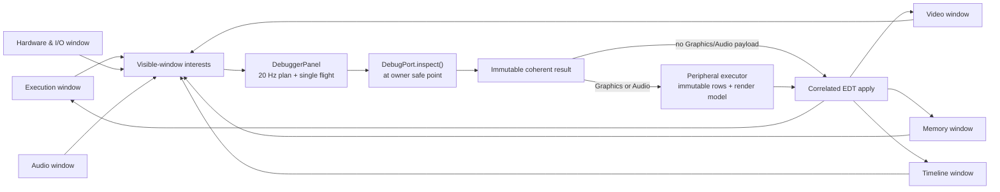

# Realtime multi-window debugger UI: implementation and remaining proposal

**Status:** first production implementation completed, July 2026; remaining extensions are called
out explicitly below

**Target:** Coffee GB desktop, Swing

**Scope:** replace the debugger's single tabbed dialog with a coordinated set of live tool windows

The implemented release includes one shared 20 Hz coherent inspection stream, persistent modeless
workspace windows, structured Execution and live Memory views, a typed breakpoint editor,
graphical Video and Audio views, the typed Timeline, and a semantic Hardware & I/O browser.
Graphics capture is independently bounded to 10 Hz; tile/map/OAM/palette row preparation and pixel
render-model decoding happen on the existing peripheral worker before the EDT applies the prepared
view. The owner-side `DebugHardwareInspection` now supplies coherent joypad, serial, infrared,
OAM-DMA, VRAM-DMA, and CGB/system state without generic bus reads.

Symbols, rolling audio scopes, screen-pixel provenance, SGB border graphics, richer mapper-specific
views, watches, and bank-aware scrolling disassembly are not implemented. The built-in layouts are
CPU, Graphics, Timing, and Full; there is no custom-preset or **Save Layout As** feature.

## Decision

Coffee GB now presents debugging as a **workspace of modeless Swing windows**, not one large dialog
containing mutually exclusive tabs. The workspace has independent **Execution**, **Memory**,
**Breakpoints**, **Video**, **Hardware & I/O**, **Audio**, and **Timeline** windows. The emulator's
top-level **Debug** menu opens or raises each window; its **Layout** submenu provides CPU, graphics,
timing, and full arrangements. Debugger windows deliberately have no menu bars of their own.
Bounds, hold state, and the selected built-in layout are persisted.

Every visible, non-held window updates automatically while the game runs. There is no Refresh
action, and Pause is run control rather than an inspection prerequisite. A local **Hold updates**
control pins the window's current presentation while emulation continues; unholding returns that
window to the live stream.

Hardware values use domain controls rather than parsed generic text fields: bounded hexadecimal or
decimal spinners, combos, checkboxes, sliders, tables, trees, and custom pixel canvases. Tiles,
tile maps, sprites, palettes, and Wave RAM are graphical first, with textual details retained for
precision, copying, and accessibility. Raster lanes and rolling audio waveforms remain future work.

## Implemented change and remaining scope

| Area | Implemented in July 2026 | Explicitly remaining |
| --- | --- | --- |
| Window model | One retained workspace owns seven independent modeless windows, top-level Debug navigation, built-in arranged layouts, bounds, and per-window Hold | Custom named presets, layout-save UI, persisted inner split/column state, and detachable Video tabs |
| Updates | One 50 ms timer drives a single-flight 20 Hz scalar stream; run-control and interest changes request immediate samples; no workspace Refresh action | A measured frame-ready subscription, if future profiling justifies one |
| CPU | Structured register cells, flag indicators, execution fields, a bounded best-effort instruction context around PC, and stack table | Bank-aware scrolling disassembly, symbols/source, watches, call stack, and step-over/out |
| Memory | Live side-effect-free hex/ASCII table, address-space combo, bounded start/length spinners, PC/SP follow, and byte-change highlighting | Generic bank selection, Follow HL, editing, and side-effectful I/O/VRAM/OAM reads |
| Graphics | Pixel tile atlas, full background/window map canvases, OAM thumbnails and placement, palette grids, keyboard navigation, and linked selection | Viewport/window overlays, dirty-image caches, SGB border assets, and exact screen-composition provenance |
| Timeline | Existing bounded typed trace table and category controls in its own window | Event lanes, raster visualization, and historical pixel provenance |
| Audio | Live channel/register tables and a graphical 32-sample Wave RAM plot | Rolling per-channel scopes, internal envelope/phase history, and mute/solo commands |
| Hardware & I/O | Semantic tree/cards with raw values, decoded meanings, fixed inventory, and explicit provenance; owner snapshots cover joypad, serial/IR, DMA/HDMA, and system state | A hardware-profile-wide register manifest, richer mapper-specific state, links to specialist tools, and value-change filtering |
| Breakpoints | Typed `CardLayout` editor with dedicated bounded address/value/mask/opcode spinners, inclusive PC/watchpoint ranges, combos, and Stop semantics | General watch expressions, Log/Count actions, and run-to-cursor |

The implementation is visible in
[`DebuggerWorkspace.kt`](../swing/src/main/java/eu/rekawek/coffeegb/swing/DebuggerWorkspace.kt),
[`DebuggerWindow.kt`](../swing/src/main/java/eu/rekawek/coffeegb/swing/DebuggerWindow.kt),
[`DebuggerGraphicsPanel.kt`](../swing/src/main/java/eu/rekawek/coffeegb/swing/DebuggerGraphicsPanel.kt),
[`DebuggerPeripheralPanePreparation.kt`](../swing/src/main/java/eu/rekawek/coffeegb/swing/DebuggerPeripheralPanePreparation.kt),
[`DebuggerHardwarePanel.kt`](../swing/src/main/java/eu/rekawek/coffeegb/swing/DebuggerHardwarePanel.kt),
and
[`DebuggerBreakpointPanel.kt`](../swing/src/main/java/eu/rekawek/coffeegb/swing/DebuggerBreakpointPanel.kt).
The platform-neutral safe-point contract is documented in
[`debug-port.md`](debug-port.md).

## Reference audit

The proposal combines established patterns rather than copying any one product.

| Reference | Pattern worth adopting | Coffee GB decision |
| --- | --- | --- |
| [Mesen Community Edition debugger source](https://github.com/nesdev-org/MesenCE/tree/master/UI/Debugger) | Saved dock/floating workspaces; code, status, watches, breakpoints, and call stack visible together; separate tile, map, sprite, event, memory, trace, and profiler tools | Coffee GB implements the persistent multi-window workspace and common key grammar; watches, call stack, and location-aware navigation remain benchmarks |
| [Emulicious](https://emulicious.net/) and its [usability update](https://emulicious.net/a-major-usability-update-of-emulicious-is-available/) | Persistent Java desktop tool windows; video viewers can remain separate or be combined; grids, selection, cross-highlighting, clickable sources, reverse debugging | Closest workflow benchmark: independent windows, related video panes, and cross-probing |
| [BGB 1.6.6](https://bgb.bircd.org/) and its [debugger manual](https://bgb.bircd.org/manual.html) | Live data while emulation runs; graphical BG map, tiles, OAM, and palette; strong forward/reverse shortcut vocabulary | Live inspection must be the normal state; Pause remains optional |
| [SameBoy](https://sameboy.github.io/features/) and its macOS [VRAM viewer source](https://github.com/LIJI32/SameBoy/blob/master/Cocoa/Document.m) | The Cocoa frontend updates VRAM tools at VBlank and provides map viewport overlays, nearest-neighbor tiles, graphical objects, and rich metadata | Coffee GB implements coherent safe-point graphics, nearest-neighbor scaling, graphical objects, and linked Video selection; viewport overlays and a measured frame-ready feed remain open |
| [mGBA](https://github.com/mgba-emu/mgba), its current [asset-view update path](https://github.com/mgba-emu/mgba/blob/master/src/platform/qt/AssetView.cpp), and [frame inspector](https://github.com/mgba-emu/mgba/blob/master/src/platform/qt/FrameView.cpp) | Coalesced frame updates, dirty asset caches, graphical maps/tiles/OAM, selectable layers, and pixel-to-layer inspection | Coffee GB bounds graphics to 10 Hz and prepares immutable render/table models off EDT; dirty image caches and screen-composition inspection remain open |
| [IntelliJ's Debug tool window](https://www.jetbrains.com/help/idea/debug-tool-window.html), [changed values](https://www.jetbrains.com/help/idea/examining-suspended-program.html), and [view modes](https://www.jetbrains.com/help/idea/viewing-modes.html) | Shared command grammar, suspended-state value changes, rearrangeable views, and clear session/run state | Platform-familiar commands and persistent built-in layouts are implemented; byte-change presentation currently lives in Memory rather than every tool |

The result should feel like a focused native engineering tool: dense enough to keep context in
view, calm enough for long sessions, and predictable across Windows, macOS, and Linux.

## Workspace and window model

The emulator's top-level menu contains **Debug > Execution**, **Memory**, **Breakpoints**,
**Video**, **Hardware & I/O**, **Audio**, and **Timeline**. Selecting an entry shows or raises only
that window while leaving other visible debugger windows alone. **Debug > Layout** contains the
four built-in arrangements: **CPU debugging**, **Graphics debugging**, **Timing and I/O**, and
**Full workspace**. Applying one replaces the visible set with that arrangement and positions its
windows. There is no named custom-layout editor, **Save Layout As**, reset-layout action,
**Bring All to Front**, or standalone **Tile Visible Windows** command.

The child windows have no **Window**, **Layout**, or **View** menu and no menu bar. Copy, run-control,
and font-zoom shortcuts remain installed directly on each window. Normal debugging does not use
modal debugger dialogs.

Window bounds, Hold state, and the selected built-in layout are persisted. Snapshot
data, ROM bytes, memory, traces, breakpoint hits, symbols, paths, copied data, inner split
positions, table columns, and Video controls are not persisted. Saved bounds outside the current
screen topology are discarded in favor of normal placement.

### Window inventory

| Window | Default contents | Update behavior | Backend readiness |
| --- | --- | --- | --- |
| **Execution** | Run/reverse toolbar; register cells and flags; bounded best-effort instructions before/current/after PC; execution state; stack; stop and history status | Scalars and a bounded safe PC/SP capture at up to 20 Hz; immediate request after commands; Hold withdraws this window's interest | Multi-line banked disassembly, symbols, watches, and call stack need richer models |
| **Memory** | Address-space combo; bounded hexadecimal start/length spinners; PC/SP follow; live hex/ASCII grid and change markers | Selected safe range participates in the shared 20 Hz inspection; hidden or held windows withdraw it | Safe ROM/WRAM/HRAM views exist. Generic bank selection, Follow HL, and I/O/VRAM/OAM memory-grid access are intentionally absent |
| **Breakpoints** | Sortable table, enable toggle, typed `CardLayout` editor, dedicated PC/watchpoint ranges, bounded numeric controls, and exact stop explanation | Metadata is refreshed on session, breakpoint changes, and relevant command completion | Negotiated Stop breakpoint kinds exist. General expressions, Log/Count, and run-to need backend work |
| **Video** | Tile atlas, background/window maps, OAM thumbnails/placement, palettes, and synchronized graphical/text selection | Coherent Graphics capture at up to 10 Hz; decoding and row construction occur off EDT; hidden or held Video withdraws demand | Both VRAM banks, OAM, LCDC, DMG palettes, and CGB palette RAM exist. Frame-ready, viewport, SGB border, and pixel provenance do not |
| **Timeline** | Bounded typed event table with category controls | Requested through the shared 20 Hz inspection while visible and live | Event lanes, raster display, and prior-frame reconstruction remain open |
| **Audio** | Channel/register tables, routing and output semantics, frame-sequencer state, and graphical Wave RAM | Audio capture participates in the shared 20 Hz inspection while Audio or Hardware needs it | Rolling scopes, internal envelope/phase history, and mute/solo need new bounded data or commands |
| **Hardware & I/O** | Semantic tree/cards for CPU/speed, IRQ, timer, PPU/LCD, APU, joypad, serial/IR, DMA/HDMA, banking/system, and mapper | Scalar, Audio, and Hardware data update at up to 20 Hz; retained graphics-derived fields are marked **SAMPLED** between 10 Hz Video captures | The owner-side hardware DTO is complete for its defined groups. Profile-wide register manifests and richer mapper views remain open |

Tabs remain inside related tools such as Video and Audio, while CPU, memory, graphics, hardware,
audio, breakpoints, and events are independently movable. Detachable Video tabs are not
implemented.

## Primary interactions

### Live, held, paused, hidden, and unavailable states

Each tool window shows **LIVE**, **HELD**, or **HIDDEN** in its state bar and an exact snapshot
identity in its footer. Snapshot content says **PAUSED** or **RUNNING**. Session revocation and
unsupported/capture-off data clear old payloads and show an explanatory empty state rather than a
disabled stale value.

There is no workspace Refresh button. **Hold updates** never pauses the guest: it keeps that
window's last presentation and withdraws its interest while other live windows continue. The
shared controls expose Pause and Resume plus stepping/reverse commands according to negotiated
capabilities. Breakpoint definitions remain installed after Resume. Exact pause-owner provenance
is not available.

Inspection failures are reported in the shared status text. The normal timer can request a later
sample after the in-flight operation completes, but there is no exponential-backoff policy,
attempt counter, or dedicated **RETRYING** state.

A held window keeps its last prepared presentation and withdraws its live interest. Unholding
resubscribes immediately; hiding withdraws interest, and a session replacement clears retained
session data.

### Selection linking

Selection linking is implemented inside Video: map cells select the corresponding tile and
palette, objects synchronize the OAM row, thumbnail, placement, tile, and palette, and graphical
selection follows its adjacent accessible table. A workspace-wide typed selection bus, symbolic
Timeline navigation, cross-window breakpoint prefilling, and historical snapshot reconstruction
are not implemented.

## Dedicated Swing controls

Generic text parsing is not the default hardware interaction.

| Value or action | Swing control |
| --- | --- |
| 8/16-bit address, opcode, byte value, or mask | Reusable `DebuggerHexSpinner` built on `JSpinner` with bounded allowed ranges, a fixed-width hexadecimal editor, and an accessible numeric value |
| Address range | Linked start/end `DebuggerHexSpinner`s in the breakpoint editor, or start + length spinners in Memory; the models enforce ordering and safe bounds |
| Counter, PPU frame, or LY | Bounded decimal `JSpinner` |
| Address space, interrupt, PPU mode, palette, and VRAM bank | `JComboBox`; a bank combo appears only when the captured model exposes valid bank identities |
| Editable breakpoint masks | Optional non-zero hexadecimal mask spinner paired with an explicit checkbox |
| Read-only CPU flags and hardware bits | Noninteractive labeled indicators or value cells with accessible state; they do not masquerade as controls |
| Trace categories and optional breakpoint constraints | `JCheckBox` controls |
| Breakpoint kind | `JComboBox` driving a `CardLayout` editor |
| Breakpoint action | Fixed **Stop** semantics; Log/Count controls are absent |
| Video zoom | `JSlider` with bounded integer scale |
| Tiles, maps, sprites, palettes, and Wave RAM | Keyboard-navigable custom Swing canvases with adjacent accessible tables |
| Hex memory, current instruction, stack, and events | Stable `JTable` models |
| Hardware subsystem navigation | `JTree` driving fixed semantic cards |
| Run, pause/resume, step, reverse, follow PC/SP, and hold | Dedicated buttons, combos, checkboxes, and workspace key bindings; run-to and additional follow anchors are absent |

Free-form text is retained for the breakpoint list filter and textual/copyable output. It is not
used to obtain breakpoint addresses, ranges, byte values, masks, opcodes, counters, PPU state, or
the live Memory range.

## Semantic Hardware & I/O window

**Hardware & I/O** is a first-class modeless window, not a raw `$FF00–$FF7F` hex dump. It answers
both “what is this register?” and “why is the machine in this state?” while keeping the exact
address and byte available for low-level work.

The implemented panel uses a `JSplitPane` with a `JTree` on the left and a `CardLayout` detail
surface on the right. The tree contains **Overview**, **CPU & Speed**, **Interrupts**, **Timer**,
**PPU / LCD**, **Audio / APU**, **Joypad**, **Serial / Infrared**, **DMA / HDMA**,
**Banking & System**, and **Mapper**. Snapshot identity, run state, controller frame/tick, capture
availability, CPU speed, and hardware mode are semantic fields; the enclosing tool window supplies
Live/Held/Hidden status.

Each register row has the same anatomy:

- hexadecimal address and canonical symbol, such as `$FF07 TAC`;
- read-only raw value in a fixed-width value label;
- decoded named fields, units, and active-low behavior in noninteractive indicators;
- provenance: **CURRENT**, **SAMPLED**, **TRACE**, **UNKNOWN**, or **NOT EXPOSED**.

`CAPTURE OFF`, `STALE CAPTURE`, and similar phrases are explicit raw/status values, not fabricated
register bytes. **SAMPLED** identifies a coherent graphics-derived value retained between the 10 Hz
graphics samples while scalar and owner-side Hardware fields continue at 20 Hz.

Read-only values use enabled labels and fixed semantic rows rather than disabled editable controls.
The enclosing window provides Hold/Live behavior. Changed-only filtering, numeric-format controls,
progress-bar/diagram renderers, specialist-tool links, and **Break when…** prefilling are not
implemented.

### Semantic register coverage

| Group | Implemented semantic presentation | Data source and remaining gap |
| --- | --- | --- |
| **Interrupts** | IME, delayed EI, IF, IE, enabled requests, and five named requested/enabled/pending interrupt lines | `DebugInterruptState` supplies the coherent current matrix. `IE` at `$FFFF` is included because it is semantically inseparable even though it lies outside the I/O page |
| **Timer** | `$FF04–$FF07` as internal DIV phase, TIMA/TMA, decoded TAC enable/frequency/input bit, and overflow/reload countdown | `DebugTimerState` supplies the current values |
| **PPU/LCD** | `$FF40–$FF4B` core LCD state, LY/LYC, scrolling/window coordinates, DMG palettes, VBK, and CGB palette-index status | `DebugSnapshot` and the 10 Hz `DebugGraphicsInspection` supply these fields. The CPU-visible indexed BGPD/OBPD byte and PPU-card OPRI remain explicitly unexposed; there is no raster marker or Video link |
| **Audio/APU** | Power/channel state; every address from `$FF10` through `$FF2F`; all 16 Wave RAM bytes at `$FF30–$FF3F`; decoded NR50/NR51/NR52 and channel registers | `DebugSnapshot`, `DebugAudioInspection`, and Hardware PCM12/PCM34 supply coherent values. Reserved `$FF15`/`$FF1F` and unmapped `$FF27–$FF2F` are explicit semantic rows rather than zeros. Rolling envelope/sweep/phase history is absent |
| **Joypad/SGB input** | `$FF00 JOYP`, P14/P15 selectors, pressed buttons, filtered low nibble, and SGB multiplayer/packet progress | `DebugHardwareInspection.Joypad` is captured directly from the owning Joypad component. A graphical controller diagram is not implemented |
| **Serial/IR** | `$FF01 SB`, `$FF02 SC`, transfer progress/clock state, `$FF56 RP`, and IR signal state | `DebugHardwareInspection.Serial` and `.Infrared` are coherent owner-side captures |
| **DMA/HDMA** | `$FF46` OAM DMA state plus `$FF51–$FF55` VRAM DMA latches, mode, source/destination, and progress semantics | `DebugHardwareInspection.OamDma` and `.VramDma` are coherent owner-side captures; unavailable DMG-only VRAM DMA remains explicit |
| **CPU, speed, and system** | CPU pipeline/speed plus hardware mode, KEY0/KEY1, VBK/SVBK, boot-ROM mapping, OPRI, FF72–FF75, and PCM12/PCM34 | `DebugSnapshot` and `DebugHardwareInspection.System` supply the current fields; unsupported DMG-only fields use explicit sentinels |
| **Cartridge/mapper** | Mapper type, ROM/RAM bank, RAM enable, RTC selection, and rumble feature state | `DebugMapperState` exposes a portable generic subset. Mapper-specific RTC registers, detailed banking state, and richer cartridge views remain absent |

Coverage currently uses a fixed semantic field inventory per subsystem. It deliberately includes
the complete APU `$FF10–$FF2F` range and Wave RAM `$FF30–$FF3F`, including reserved and unmapped
APU addresses. A hardware-profile-wide register manifest and a completeness test against every
mapped DMG/CGB/SGB I/O owner remain future hardening; the current Hardware window must not be read
as a claim that every I/O-page address has a row.

Safe inspection now includes the capability-gated `DebugInspectionSection.HARDWARE` and bounded
immutable `DebugHardwareInspection`. The emulation owner composes it from pure observation methods
on Joypad, SerialPort, InfraredPort, OAM DMA, VRAM DMA, and system/MMU-owned state. Timer, CPU, PPU,
mapper, Audio, and Graphics values continue to come from their coherent snapshot or specialist
inspection DTOs. The Hardware window correlates all of them by the same snapshot identity.

No Hardware field is obtained through a generic CPU-bus read: I/O reads may apply masks, expose
transient bus behavior, or have device-specific side effects.

Rows explicitly distinguish **configured/latched internal value** from **CPU readback**. They do
not fabricate readback for write-only registers such as HDMA source/destination, and they do not
call device getters with observable behavior. For example, IF has transient CPU-read masks,
FF56/RP reads may notify an accessory, DMG OAM reads can corrupt OAM, and palette/Wave RAM reads
are lock dependent. Side-effect-free capture methods on the owning components are therefore part
of the feature, not an implementation detail.

## Implemented graphical data and boundaries

Graphics are authoritative visual surfaces, not decorative previews beside textual dumps.

### Tile atlas

- Render all 384 8×8 tiles per available VRAM bank with nearest-neighbor scaling.
- Bank, palette, zoom, and grid use dedicated controls.
- Keyboard and pointer selection link to the exact tile row, address, bank, and decoded color-index
  rows.
- Pixel decoding and immutable model/table preparation occur off EDT. The current canvas images are
  rebuilt on the EDT only at the bounded 10 Hz graphics cadence; dirty image reuse is not yet
  implemented.

### Tile maps

- Render the active 32×32 Background and Window maps selected by LCDC from `$9800` or `$9C00`.
- Apply signed/unsigned tile addressing and CGB palette, bank, flip, and priority attributes.
- Zoom and grid overlays are independently controllable. Viewport/window-origin and attribute
  overlays are not implemented because the current graphical view does not carry those overlay
  coordinates.

### Sprites/OAM

- Render all 40 OAM objects as thumbnails and on a 160×144 placement canvas.
- Respect 8×8/8×16 tile selection, bank, palette, flips, clipping, and transparency in graphical
  previews, and report whether each object intersects the screen.
- Exact background/object occlusion, per-line object-limit outcomes, and prior-frame drop reasons
  are not claimed without renderer provenance.
- Selecting a sprite links to its tile and palette without requiring a separate search.

### Palettes

- Present DMG BGP/OBP mappings and CGB BG/OBJ 8×4 palettes as swatches.
- A selected swatch exposes raw RGB555/DMG shade data, decoded RGB, palette/index, and linked
  graphical selection.
- Labels and selection outlines remain readable at high contrast; color is never the sole label.

### Super Game Boy graphics

There is no SGB Border section. `DebugGraphicsInspection` contains only the Game Boy-side PPU
state, so a bounded immutable SGB graphics DTO is required before the UI can show border tiles,
maps, attribute data, and palettes or claim complete SGB inspection.

### Screen composition and pixel provenance

A future screen-composition view may identify whether a pixel came from background, window, or an
object and link to the responsible tile/palette/OAM entry. The current graphics DTO does not carry
a coherently rendered framebuffer or producer history, and the implemented raw-VRAM views do not
claim exact pixel provenance.

## Realtime data architecture

The windows do **not** poll independently. One EDT-owned `DebuggerPanel` plans the union of visible,
non-held window interests and owns the only 50 ms timer.

### Coordinator rules

1. Each visible, non-held window contributes memory, Graphics, Audio, Hardware, and/or trace
   interests; every inspection also returns the scalar snapshot.
2. `DebuggerPanel` unions those interests into one bounded `DebugInspectionRequest`.
3. At most one request is in flight. Timer/interest/command demand arriving during it sets one
   `refreshAgain` flag, so demand is conflated rather than queued. The request remains the active
   flight through peripheral preparation and EDT completion; there is no separate latest-raw slot.
4. Session generation, client identity, window epoch, and monotonic request ID are checked before
   any Swing mutation. Pending peripheral preparation is cancellable on lifecycle changes.
5. Graphics and Audio presentation DTOs are prepared on the existing peripheral executor.
   Graphics preparation decodes tile pixels and map/OAM/palette render data, constructs all table
   cells, and freezes the row lists before EDT delivery.
6. The EDT swaps in the prepared table lists and render model. Canvas images are still constructed
   on the EDT, but Graphics requests and image rebuilds are bounded to 100 ms/10 Hz rather than the
   50 ms scalar cadence.
7. Hidden or held windows withdraw their interests. Reopening or unholding resubscribes and resets
   the Graphics cadence when appropriate; no Refresh action is required.
8. Completed run-control commands and material interest changes request an immediate coherent
   sample. Typed failures are reported, and subsequent normal timer demand may try again; no
   retry/backoff state machine is claimed.

### Inspection-budget arbitration

The planner reads negotiated `maxInspectionBlocks` and `maxInspectionBytes` and never exceeds
the current upper ceilings of **16 memory blocks and 4,096 aggregate bytes**. A smaller backend
capability is authoritative; the limit is not a reason to issue extra window-specific requests.
The current deterministic plan is:

1. Scalar snapshot fields are always included and consume no memory-block budget.
2. Bounded PC- and SP-anchored code/stack reads needed by Execution are reserved first.
3. The one visible Memory interest receives the remaining eligible allocation when its request is
   safe and fits the negotiated remainder.

An excluded range is cleared and labeled **not sampled** with the reason rather than leaving old
bytes looking current. Watches and watch-budget reservation are not implemented. Graphics, Audio,
Hardware, and trace are typed sections rather than generic memory blocks.

The implementation uses asynchronous `DebugPort.inspect()` with a 20 Hz shared timer. The port
captures immutable state at safe points without pausing. A future controller-side frame-ready
subscription would require new metadata and its own measured conflation design; it is not part of
the current release.

“Realtime” here means a continuously and automatically sampled coherent view while execution
continues. It does not claim that Swing renders every CPU tick. High-frequency exact history stays
in the bounded trace buffer.

### Implemented presentation cadence

| Data | Normal visible cadence | Notes |
| --- | --- | --- |
| Registers and scalar snapshot fields | Up to 20 Hz (50 ms) | Immediate request after run-control and relevant state changes |
| Owner-side Hardware and semantic Audio fields | Up to 20 Hz (50 ms) | Requested only while a live interested window is visible |
| Graphics | Up to 10 Hz (100 ms) | Exact capture identity; immutable pixel/table model prepared off EDT; no dirty-image cache or frame-ready feed |
| Selected memory range | Up to 20 Hz (50 ms) | One safe absolute or PC/SP-anchored range in the shared request |
| Trace/events | Up to 20 Hz UI reads | Producer remains bounded; expensive categories remain explicit opt-ins |
| Audio state and Wave RAM | Up to 20 Hz (50 ms) | Rolling waveform capture requires a new bounded DTO |

These are maximum request cadences. Single-flight inspection and preparation naturally reduce the
effective rate when an operation takes longer than its timer interval; results are never queued to
catch up.

## Swing implementation shape

Implemented presentation-layer types include:

- `DebuggerWorkspace` — modeless tool-window lifecycle, built-in layouts, persisted bounds and
  Hold state, visibility/interest tracking, and shared key bindings; top-level navigation belongs
  to `SwingMenu`;
- `DebuggerPanel` — sole inspection planner, trace owner, request correlator, cadence owner, and
  EDT integration point;
- `DebuggerExecutionPanel`, `DebuggerMemoryPanel`, `DebuggerBreakpointPanel`,
  `DebuggerGraphicsPanel`, `DebuggerAudioPanel`, and `DebuggerHardwarePanel` — dedicated tool
  surfaces;
- `DebuggerHexSpinner` — reusable bounded hexadecimal spinner used by Memory and breakpoint
  address/value/mask/opcode controls;
- `DebuggerTileAtlasCanvas`, `DebuggerTileMapCanvas`, OAM canvases, and `DebuggerPaletteCanvas` —
  keyboard-accessible graphical Video components;
- immutable `DebuggerGraphicsPaneView`, `DebuggerGraphicsRenderModel`, and prepared table data —
  the worker/EDT boundary for heavy graphics presentation;
- `DebuggerHeavyPaneCadence` — the independent monotonic 10 Hz Graphics gate.

There is no separate action registry, workspace-wide selection bus, hardware register manifest,
raster canvas, or rolling waveform canvas in this release.

Snapshot labels carry session, snapshot sequence, and master tick; Timeline rows also carry their
trace sequence, master tick, and fetching snapshot identity. PPU event text carries its PPU frame,
line, dot, and mode. Consistently spelling out **controller frame** versus **PPU frame** in every
detail string remains presentation polish.

The implementation uses system/theme colors from `UIManager`, Swing's normal focus behavior,
platform menu shortcuts, and monospaced code/hex fonts. A third-party look and feel is not required
to achieve a professional layout; the data hierarchy, spacing, interaction consistency, and native
semantics matter more.

## Accessibility and professional presentation

The workspace retains Coffee GB's accessible labels/descriptions, focus traversal, font scaling,
copyable text, and platform menu shortcuts.

- Read-only flags and raw values include text and accessible state; color is supplemental.
- The Memory table compares consecutive coherent samples and highlights changed bytes.
- Every custom Video canvas has an accessible name/summary, keyboard cursor and selection, and
  bounded zoom where applicable.
- A selected graphical item feeds an adjacent normal detail table, so metadata does not require
  color perception or pixel-precise pointing.
- Core buttons have visible labels, tooltips or accessible descriptions, mnemonics, and fixed
  workspace shortcuts.
- Font scaling is shared across the workspace; theme/high-contrast behavior derives from
  `UIManager`. A formal multi-scale/high-contrast certification matrix is not claimed here.

Oracle's current [Java Accessibility Guide](https://docs.oracle.com/en/java/javase/26/access/index.html)
is the desktop baseline for custom components. [WCAG 2.2](https://www.w3.org/TR/WCAG22/) supplies
additional design guidance rather than a normative Swing conformance target.

## Repository constraints and honest capability boundaries

The implementation builds on these repository contracts:

- `DebugPort` is asynchronous, bounded, and safe-point based.
- `DebugInspectionResult` combines one snapshot with memory, Graphics, Audio, Hardware, and trace.
- `DebugGraphicsInspection` copies both available VRAM banks, OAM, DMG registers, and CGB palettes.
- `DebugHardwareInspection` copies joypad, serial/IR, DMA/HDMA, and system state from owning
  components without CPU-bus reads.
- `DebuggerPeripheralPresentation` decodes tiles, map attributes, sprites, palettes, channel state,
  and Wave RAM.
- `DebuggerBreakpointDraftEditor` uses bounded spinners for numeric fields and linked inclusive
  range controls for PC and memory conditions.
- typed breakpoints, reverse history, typed trace events, cancellation, stale-result correlation,
  and accessibility infrastructure already exist.

The following are deliberate current limitations and must not be implied by the UI:

- register, memory, PPU, or APU editing — there is no atomic safe-point mutation protocol;
- full bank-correct scrolling disassembly, source, symbols, step-over/out, or call stacks — these
  need a bank-aware `DebugLocation` and structured instruction/source models;
- generic I/O/VRAM/OAM reads through the memory grid — use decoded hardware/graphics DTOs;
- raw generic CPU-bus reads as a substitute for semantic I/O capture — register ownership,
  masks, latches, and transient state must be copied by the owning components;
- generic ROM/WRAM bank selectors, Follow HL, and run-to-cursor — these need bank-aware addressing
  or new command/anchor capabilities;
- a true per-channel oscilloscope — current audio inspection has channel state and Wave RAM, not a
  rolling sample history;
- per-channel mute/solo commands — no debug mutation command currently owns those changes;
- exact debugger/application/external pause ownership — current snapshots expose effective paused
  state and breakpoint-hit context, but general cause-aware release needs new provenance metadata;
- exact screen pixel provenance — current inspection does not include a coherent renderer result;
- SGB border, attribute, tile, and palette inspection — the current graphics DTO exposes only the
  Game Boy-side PPU;
- unrestricted live PC/SP reads across side-effectful address boundaries — planners preserve
  current validation and bounded one-shot re-planning;
- breakpoint Log/Count actions — the current action is Stop, so alternatives stay hidden until
  their semantics and storage are implemented;
- cheap always-on CPU/memory tracing — expensive trace categories remain visible opt-ins.

## Delivered scope and next milestones

Delivered in the current tree:

- seven retained modeless tool windows with top-level Debug navigation, built-in
  CPU/Graphics/Timing/Full arrangements, persisted bounds/Hold state, and session-safe lifecycle;
- one single-flight 20 Hz coherent planner with hidden/held interest withdrawal and immediate
  command/interest refresh demand;
- structured Execution, live safe Memory with PC/SP follow, typed breakpoint cards with dedicated
  spinners/ranges, bounded Timeline, and graphical Audio Wave RAM;
- graphical tiles, active Background/Window maps, OAM thumbnails/placement, and DMG/CGB palettes;
- 10 Hz Graphics capture with immutable pixel render-model and table preparation off EDT;
- semantic Hardware cards, complete owner-side `DebugHardwareInspection` for its declared
  joypad/serial/IR/DMA/HDMA/system scope, and explicit APU reserved/unmapped/Wave RAM inventory.

Prioritized remaining milestones:

1. Bank-aware scrolling disassembly, symbols/source, watches, call stack, and step-over/out.
2. Timeline lanes/raster correlation and a workspace-wide typed selection/navigation bus.
3. Measured dirty Video image caching, viewport/window overlays, and optional frame-ready metadata.
4. Bounded rolling audio samples and per-channel scopes; mutation commands such as mute/solo only
   after a safe ownership protocol exists.
5. Hardware-profile-wide register manifests/completeness checks, richer mapper-specific views, SGB
   graphics, and exact screen-pixel provenance.

## Current readiness checklist

| Requirement | Current status |
| --- | --- |
| Multiple independently movable Swing windows | Implemented: seven modeless tool windows |
| Ordinary inspection without Refresh/Read or Pause | Implemented for scalar state, supported safe Memory, Graphics, Audio, Hardware, and enabled trace categories |
| Shared bounded request ownership | Implemented: one timer, one planner, one in-flight request, one conflated repeat flag, and at most one peripheral preparation task |
| Realtime cadence | Implemented: scalar/Memory/Audio/Hardware/trace at up to 20 Hz; Graphics at up to 10 Hz |
| Off-EDT heavy graphics work | Implemented for pixel decoding, immutable render models, palette previews, and all table-row construction; canvas image construction remains EDT work at 10 Hz |
| Graphical Game Boy video data | Implemented for tiles, active Background/Window maps, all 40 OAM entries, and DMG/CGB palettes; SGB and pixel provenance are absent |
| Semantic Hardware provenance | Implemented with Current, Sampled, Trace, Unknown, and Not exposed states plus explicit capture-status text |
| Semantic APU inventory | Implemented for `$FF10–$FF2F` including reserved/unmapped rows and Wave RAM `$FF30–$FF3F` |
| Dedicated numeric controls | Implemented for live Memory and all numeric breakpoint fields, including inclusive PC/watchpoint ranges |
| Snapshot coherence | Implemented through exact session/snapshot/tick identities and stale-request correlation; held windows retain their own last presentation |
| Hidden/Held demand withdrawal | Implemented; reopening or unholding resubscribes automatically |
| Accessible graphical equivalents | Implemented with keyboard-accessible canvases and adjacent copyable detail tables |
| Symbols, rolling scopes, mapper-rich views, event lanes, custom layouts | Not implemented and not represented as available |
